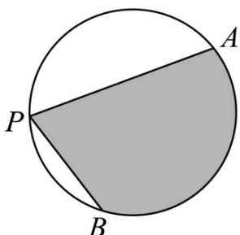

<!-- question-source:start -->
2.（ $^{2019}$ ·北京·高考真题）如图，A，B是半径为 $^{2}$ 的圆周上的定点，P为圆周上的动点，∠APB是锐角，大小为β.图中阴影区域的面积的最大值为

A. $4\beta + 4\cos \beta$ B. $4\beta + 4\sin \beta$ C. $2\beta + 2\cos \beta$ D. $2\beta + 2\sin \beta$
<!-- question-source:end -->

![[高中/真题/按题型分类/专题10 三角恒等变换与解三角形小题综合/考点07_解三角形小题综合之求最值或范围/真题/answers/Q00034156A1.md]]
