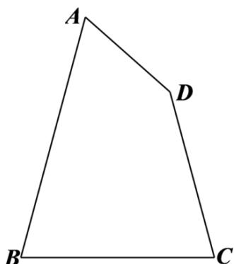

<!-- question-source:start -->
5. （2015·全国·高考真题）如图在平面四边形ABCD中， $\angle A=\angle B=\angle C=75^{\circ}$ ，BC=2，则AB的取值范围是

<!-- question-source:end -->

![[高中/真题/按题型分类/专题10 三角恒等变换与解三角形小题综合/考点07_解三角形小题综合之求最值或范围/真题/answers/Q00034159A1.md]]
