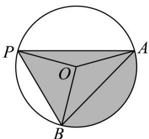

> [!faq]- 《专题10 三角恒等变换与解三角形小题综合》真题解析
>
> > [!success]- **【答案】** B
>
> > [!note]- **【分析】**
> > 【分析】由题意首先确定面积最大时点 $P$ 的位置，然后结合扇形面积公式和三角形面积公式可得最大的面积值·
>
> > [!note]- **【解析】**
> > 【详解】观察图象可知，当 P 为弧 AB 的中点时，阴影部分的面积 S 取最大值，此时 $\angle BOP = \angle AOP = \pi -\beta$ ，面积 $S$ 的最大值为 $\pi \times 2^2\times \frac{2\beta}{2\pi} +S_{\triangle}POB^{+}$ $S_{\triangle}POA = 4\beta +\frac{1}{2} |OH|OB|\sin (\pi -\beta)$ $+\frac{1}{2}|OH|OA|\sin (\pi -\beta)$ $= 4\beta +2\sin \beta +2\sin \beta = 4\beta +4\cdot \sin \beta .$
> > 
> > 故选 B·
> > 【点睛】本题主要考查阅读理解能力、数学应用意识、数形结合思想及数学式子变形和运算求解能力，有一定的难度·关键观察分析区域面积最大时的状态，并将面积用边角等表示·
