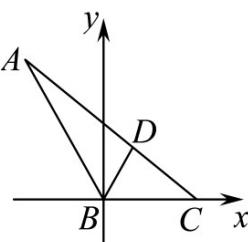
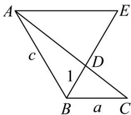

> [!faq]- 《专题10 三角恒等变换与解三角形小题综合》真题解析
>
> > [!success]- **【答案】** 详见解析
>
> > [!note]- **【分析】**
> > 【分析】方法一：先根据角平分线性质和三角形面积公式得条件 $\frac{1}{a} +\frac{1}{c} = 1$ ，再利用基本不等式即可解出.
>
> > [!note]- **【解析】**
> > 【详解】[方法一]：【最优解】角平分线定义+三角形面积公式+基本不等式
> > 由题意可知， $S_{\triangle ABC} = S_{\triangle ABD} + S_{\triangle BCD}$ ，由角平分线定义和三角形面积公式得
> > $\frac{1}{2} ac\sin 120^{\circ} = \frac{1}{2} a\times 1\times \sin 60^{\circ} + \frac{1}{2} c\times 1\times \sin 60^{\circ}$ ，化简得 $ac = a + c$ ，即 $\frac{1}{a} +\frac{1}{c} = 1$
> > 因此 $4a + c = (4a + c)\left(\frac{1}{a} + \frac{1}{c}\right) = 5 + \frac{c}{a} + \frac{4a}{c}$ $5 + 2\sqrt{\frac{c}{a} \cdot \frac{4a}{c}} = 9,$
> > 当且仅当 c=2a=3 时取等号，则 $4a+c$ 的最小值为 9.
> > 故答案为：9.
> > [方法二]：角平分线性质 + 向量的数量积 + 基本不等式
> > 由三角形内角平分线性质得向量式 $\overline{BD} = \frac{a}{a + c}\overline{BA} +\frac{c}{a + c}\overline{BC}$ 因为 $BD = 1$ ，所以 $1 = \left(\frac{a}{a + c}\right)^2\overrightarrow{BA}^2 +\left(\frac{c}{a + c}\right)^2\overrightarrow{BC}^2 +2\frac{ac}{(a + c)^2}\overrightarrow{BA}\cdot \overrightarrow{BC}$ ，化简得 $1 = \frac{ac}{a + c}$ ，即 $ac = a + c$ ，亦即 $(a - 1)(c - 1) = 1$ 所以 $4a + c = 4(a - 1) + (c - 1) + 5\quad 5 + 2\sqrt{4(a - 1)(c - 1)} = 9$ 当且仅当 $4(a - 1) = c - 1$ ，即 $a = \frac{3}{2},c = 3$ 时取等号.
> > ## [方法三]：解析法+基本不等式
> > 如图5，以 $B$ 为坐标原点， $BC$ 所在直线为 $x$ 轴建立平面直角坐标系．设 $C(a,0)$
> > $D\left(\frac{1}{2}, \frac{\sqrt{3}}{2}\right), A\left(-\frac{1}{2}c, \frac{\sqrt{3}}{2}c\right)$ . 因为 $A, D, C$ 三点共线，则 $k_{AD} = k_{CD}$ ，即 $\frac{\frac{\sqrt{3}}{2}c - \frac{\sqrt{3}}{2}}{-\frac{1}{2}c - \frac{1}{2}} = \frac{\frac{\sqrt{3}}{2}}{\frac{1}{2} - a}$ ，则有 $a + c = ac$ 所以 $\frac{1}{a} + \frac{1}{c} = 1$ .
> > 
> > 图5
> > 下同方法一.
> > [方法四]：角平分线定理 + 基本不等式
> > 在 $\triangle BDC$ 中， $CD = \sqrt{a^2 + 1 - 2a\cos\frac{\pi}{3}} = \sqrt{a^2 + 1 - a}$ ，同理 $AD = \sqrt{c^2 + 1 - c}$ 。根据内角平分线性质定理知 $\frac{CD}{AD} = \frac{BC}{AB}$ ，即 $\frac{\sqrt{a^2 + 1 - a}}{\sqrt{c^2 + 1 - c}} = \frac{a}{c}$ ，两边平方，并利用比例性质得 $\frac{1 - a}{1 - c} = \frac{a^2}{c^2}$ ，整理得 $(a - c)(a + c - ac) = 0$ ，当 $a = c$ 时，可解得 $a = c = 2, 4a + c = 10$ 。当 $a + c = ac$ 时，下同方法一。
> > [方法五]：正弦定理+基本不等式
> > 在 $\triangle ABD$ 与 $\triangle BCD$ 中，由正弦定理得 $\frac{AD}{\sin 60^\circ} = \frac{1}{\sin A}, \frac{CD}{\sin 60^\circ} = \frac{1}{\sin C}$ 。在 $\triangle ABC$ 中，由正弦定理得 $\frac{a}{\sin A} = \frac{b}{\sin B} = \frac{AD + CD}{\sin 120^\circ} = \frac{AD}{\sin 60^\circ} + \frac{CD}{\sin 60^\circ}$ 。
> > 所以 $\frac{a}{\sin A} = \frac{1}{\sin A} + \frac{1}{\sin C}$ ，由正弦定理得 $1 = \frac{a}{a} = \frac{1}{a} + \frac{1}{c}$ ，即 $ac = a + c$ ，下同方法一。
> > [方法六]：相似 + 基本不等式
> > 如图6，作 $AE \parallel BC$ ，交 $BD$ 的延长线于 $E$ ．易得 $\triangle ABE$ 为正三角形，则 $AE = c, DE = c - 1$
> > 
> > 图6
> > 由 $\triangle ADE \sim \triangle CDB$ ，得 $\frac{AE}{BC} = \frac{DE}{BD}$ ，即 $\frac{c}{a} = \frac{c - 1}{1}$ ，从而 $a + c = ac$ ．下同方法一．
> > 【整体点评】方法一：利用角平分线定义和三角形面积公式建立等量关系，再根据基本不等式“1”的代换求出最小值，思路常规也简洁，是本题的最优解；
> > 方法二：利用角平分线的性质构建向量的等量关系，再利用数量积得到 $a, c$ 的关系，最后利用基本不等式求出最值，关系构建过程运算量较大；
> > 方法三：通过建立直角坐标系，由三点共线得等量关系，由基本不等式求最值；
> > 方法四：通过解三角形和角平分线定理构建等式关系，再由基本不等式求最值，计算量较大；
> > 方法五：多次使用正弦定理构建等量关系，再由基本不等式求最值，中间转换较多；
> > 方法六：由平面几何知识中的相似得等量关系，再由基本不等式求最值，求解较为简单。
