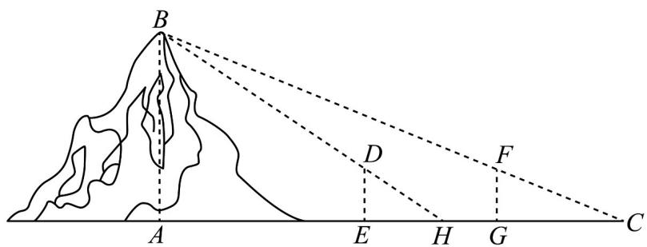

<!-- question-source:start -->
2．（2021·全国乙卷·高考真题）魏晋时刘徽撰写的《海岛算经》是有关测量的数学著作，其中第一题是测海岛的高．如图，点E，H，G在水平线AC上，DE和FG是两个垂直于水平面且等高的测量标杆的高度，称为“表高”，EG称为“表距”，GC和EH都称为“表目距”，GC与EH的差称为“表目距的差”则海岛的高 $AB = (\quad)$

A. $\frac{\text{表高} \times \text{表距}}{\text{表目距的差}} +$ 表高 B. $\frac{\text{表高} \times \text{表距}}{\text{表目距的差}} -$ 表高 C. $\frac{\text{表高} \times \text{表距}}{\text{表目距的差}} +$ 表距 D. $\frac{\text{表高} \times \text{表距}}{\text{表目距的差}} -$ 表距
<!-- question-source:end -->

![[高中/真题/按题型分类/专题10 三角恒等变换与解三角形小题综合/考点08_解三角形小题综合之实际应用/真题/answers/Q00034161A1.md]]
