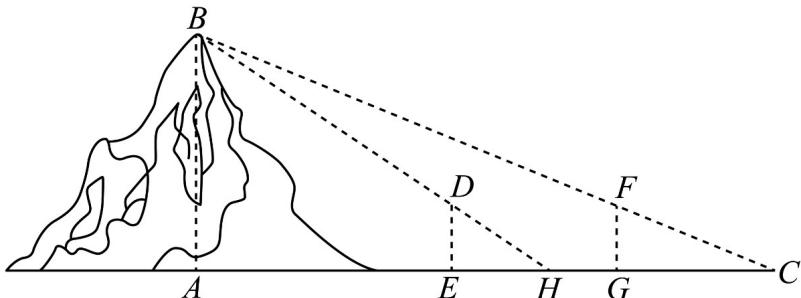

> [!faq]- 《专题10 三角恒等变换与解三角形小题综合》真题解析
>
> > [!success]- **【答案】** A
>
> > [!note]- **【分析】**
> > 【分析】利用平面相似的有关知识以及合分比性质即可解出.
>
> > [!note]- **【解析】**
> > 【详解】如图所示：
> > 
> > 由平面相似可知， $\frac{DE}{AB} = \frac{EH}{AH},\frac{FG}{AB} = \frac{CG}{AC}$ ，而 $DE = FG$ ，所以
> > $\frac{DE}{AB} = \frac{EH}{AH} = \frac{CG}{AC} = \frac{CG - EH}{AC - AH} = \frac{CG - EH}{CH}$ 而 $CH = CE - EH = CG - EH + EG$
> > 即 $AB = \frac{CG - EH + EG}{CG - EH} \times DE = \frac{EG \times DE}{CG - EH} + DE = \frac{\text{表高} \times \text{表距}}{\text{表目距的差}} + \text{表高}$
> > 故选：A.
> > 【点睛】本题解题关键是通过相似建立比例式，围绕所求目标进行转化即可解出。
