<!-- source-part:1 pages:1-49 -->

# 十年真题 2015-2024

## 专题11 立体几何基本概念与计算小题综合

## 十年考情·探规律

<table><tr><td>考点</td><td>十年考情(2015-2024)</td><td>命题趋势</td></tr><tr><td>考点1 点线面的位置关系及其判断(10年7考)</td><td>2024·全国甲卷、2024·天津卷、2022·全国乙卷2021·浙江卷、2021·全国新II卷、2019·全国卷2019·全国卷、2019·北京卷、2017·全国卷2016·浙江卷、2016·山东卷、2016·全国卷2015·浙江卷、2015·湖北卷、2015·广东卷2015·福建卷、2015·北京卷</td><td rowspan="3">1.理解、掌握空间中点线面的位置关系及相关的图形和符号语言,熟练掌握平行关系的判定定理和性质定理及其应用,熟练掌握垂直关系的判定定理和性质定理及其应用,该内容是新高考卷的常考内容,需强化巩固复习.2.了解柱、锥、台体及简单组合体的结构特征及其相关性质,会运用柱体、锥体、台体等组合体的表面积和体积的计算公式求解相关问题,该内容是新高考卷的常考内容,一般给定柱、锥、台体及简单组合体,求对应的表面积与体积,需强化复习.</td></tr><tr><td>考点2 求几何体的体积(10年10考)</td><td>2024·全国新I卷、2024·天津卷、2024·全国甲卷2024·北京卷、2023·全国甲卷、2023·全国乙卷2023·全国新I卷、2023·天津卷、2023·全国新I卷2023·全国新II卷、2022·天津卷、2022·全国甲卷2022·全国新I卷、2022·全国新II卷、2021·全国新II卷2021·北京卷、2021·全国新I卷、2020·海南卷2020·江苏卷、2019·江苏卷、2019·全国卷2019·天津卷、2018·江苏卷、2018·全国卷2018·天津卷、2018·天津卷、2017·全国卷2016·浙江卷、2015·上海卷、2015·江苏卷2015·全国卷、2015·山东卷、2015·山东卷</td></tr><tr><td>考点3 求几何</td><td>2023·全国甲卷、2021·全国新I卷、2021·全国甲卷</td></tr><tr><td>体的侧面积、表面积(10年4考)</td><td>2020·全国卷、2018·全国卷、2018·全国卷</td><td></td></tr></table>

## 分考点·精准练

## 考点 01 点线面的位置关系及其判断

1. (2024·全国甲卷·高考真题) 设 $\alpha, \beta$ 为两个平面， $m, n$ 为两条直线，且 $\alpha \cap \beta = m$ . 下述四个命题：
①若 $m // n$ ，则 $n // \alpha$ 或 $n // \beta$ ②若 $m \perp n$ ，则 $n \perp \alpha$ 或 $n \perp \beta$

③若 $n / / \alpha$ 且 $n / / \beta$ ，则 $m / / n$ ④若 $n$ 与 $\alpha, \beta$ 所成的角相等，则 $m \perp n$

其中所有真命题的编号是（）
A. ①③ B. ②④ C. ①②③ D. ①③④

【答案】A

【分析】根据线面平行的判定定理即可判断①；举反例即可判断②④；根据线面平行的性质即可判断③·
【详解】对①，当 $n\subset\alpha$ ，因为 $m//n,\quad m\subset\beta$ ，则 $n//\beta$

当 $n \subset \beta$ ，因为 $m // n$ ， $m \subset \alpha$ ，则 $n // \alpha$

当 $n$ 既不在 $\alpha$ 也不在 $\beta$ 内，因为 $m / / n$ ， $m \subset \alpha, m \subset \beta$ ，则 $n / / \alpha$ 且 $n / / \beta$ ，故①正确；

对②，若 $m \perp n$ ，则 $n$ 与 $\alpha, \beta$ 不一定垂直，故②错误；

对③，过直线 $n$ 分别作两平面与 $\alpha, \beta$ 分别相交于直线 $s$ 和直线 $t$

因为 $n / / \alpha$ ，过直线 $n$ 的平面与平面 $\alpha$ 的交线为直线 $s$ ，则根据线面平行的性质定理知 $n / / s$

同理可得 $n / / t$ ，则 $s / / t$ ，因为 $s\notin$ 平面 $\beta$ ， $t\subset$ 平面 $\beta$ ，则 $s / /$ 平面 $\beta$

因为 $s \subset$ 平面 $\alpha$ ， $\alpha \cap \beta = m$ ，则 $s // m$ ，又因为 $n // s$ ，则 $m // n$ ，故③正确；

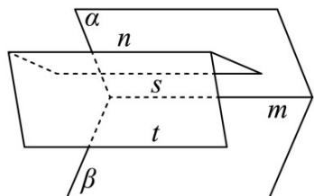

对④，若 $\alpha\cap\beta=m,n$ 与 $\alpha$ 和 $\beta$ 所成的角相等，如果 $n//\alpha,n//\beta$ ，则 $m//n$ ，故④错误；

综上只有①③正确，

故选：A.

2.（2024·天津高考真题）若 $m, n$ 为两条不同的直线， $\alpha$ 为一个平面，则下列结论中正确的是（）
A．若 $m // \alpha$ ， $n // \alpha$ ，则 $m \perp n$ B．若 $m // \alpha, n // \alpha$ ，则 $m // n$ C．若 $m // \alpha, n \perp \alpha$ ，则 $m \perp n$ D．若 $m // \alpha, n \perp \alpha$ ，则 $m$ 与 $n$ 相交

【答案】C

【分析】根据线面平行的性质可判断 $^{AB}$ 的正误，根据线面垂直的性质可判断 $^{CD}$ 的正误。
【详解】对于 $^{A}$ ，若 $m//\alpha$ ， $n//\alpha$ ，则m,n平行或异面或相交，故 $^{A}$ 错误
对于 $^{B}$ ，若 $m//\alpha, n//\alpha$ ，则m,n平行或异面或相交，故 $^{B}$ 错误
对于C， $m//\alpha, n \perp \alpha$ ，过m作平面 $\beta$ ，使得 $\beta \cap \alpha = s$ 因为 $m \subset \beta$ ，故 $m//s$ ，而 $s \subset \alpha$ ，故 $n \perp s$ ，故 $m \perp n$ ，故 $^{C}$ 正确
对于D，若 $m//\alpha, n \perp \alpha$ ，则m与n相交或异面，故D错误

故选：C.

3. (2022·全国乙卷·高考真题) 在正方体 $ABCD - A_{1}B_{1}C_{1}D_{1}$ 中, $E$ , $F$ 分别为 $AB, BC$ 的中点, 则 ( )

A. 平面 $B_{1}EF \perp$ 平面 $BDD_{1}$ B. 平面 $B_{1}EF \perp$ 平面 $A_{1}BD$ C. 平面 $B_{1}EF //$ 平面 $A_{1}AC$ D. 平面 $B_{1}EF //$ 平面 $A_{1}C_{1}D$

【答案】A

【分析】证明 $EF \perp$ 平面 $BDD_{1}$ ，即可判断 A；如图，以点 D 为原点，建立空间直角坐标系，设 AB = 2，分别求出平面 $B_{1}EF$ ， $A_{1}BD$ ， $A_{1}C_{1}D$ 的法向量，根据法向量的位置关系，即可判断 BCD.

【详解】解：在正方体 $ABCD - A_{1}B_{1}C_{1}D_{1}$ 中， $AC \perp BD$ 且 $DD_{1} \perp$ 平面 $ABCD$ ，又 $EF \subset$ 平面 $ABCD$ ，所以 $EF \perp DD_{1}$ ，因为 $E, F$ 分别为 $AB, BC$ 的中点，所以 $EF \parallel AC$ ，所以 $EF \perp BD$ ，

又 $BD \cap DD_{1} = D$

所以 $EF \perp$ 平面 $BDD_{1}$ ，

又 $EF \subset$ 平面 $B_{1}EF$

所以平面 $B_{1}EF \perp$ 平面 $BDD_{1}$ ，故 $\mathsf{A}$ 正确；

选项 BCD 解法一：

如图，以点 D 为原点，建立空间直角坐标系，设 AB = 2 ，

则 $B_{1}(2,2,2),E(2,1,0),F(1,2,0),B(2,2,0),A_{1}(2,0,2),A(2,0,0),C(0,2,0)$

$$
C _ {1} (0, 2, 2)
$$

则 $EF = (-1,1,0)$ , $EB_{1} = (0,1,2)$ , $DB = (2,2,0)$ , $DA_{1} = (2,0,2)$ ,

$$
\stackrel {{\sqcup \sqcup \sqcup}} {{A A _ {1}}} = (0, 0, 2), \stackrel {{\sqcup \sqcup \sqcup}} {{A C}} = (- 2, 2, 0), \stackrel {{\sqcup \sqcup \sqcup \sqcup}} {{A _ {1} C _ {1}}} = (- 2, 2, 0),
$$

设平面 $B_{1}EF$ 的法向量为 $m=(x_{1},y_{1},z_{1})$

则有 $\left\{ \begin{array}{l} m \cdot \overline{EE} = -x_1 + y_1 = 0 \\ m \cdot EB_1 = y_1 + 2z_1 = 0 \end{array} \right.$ ，可取 $m = (2, 2, -1)$ ，

同理可得平面 $A_{1}BD$ 的法向量为 $n_{1}=\left(1,-1,-1\right)$

平面 $A_{1}AC$ 的法向量为 $n_{2} = (1,1,0)$

平面 $A_{1}C_{1}D$ 的法向量为 $\overline{n_3} = (1,1, - 1)$

则 $m \cdot n_{1} = 2 - 2 + 1 = 1 \neq 0$

所以平面 $B_{1}EF$ 与平面 $A_{1}BD$ 不垂直，故 B 错误；

因为 $m$ 与 $n_2$ 不平行，

所以平面 $B_{1}EF$ 与平面 $A_{1}AC$ 不平行，故 C 错误；

因为 $m$ 与 $n_3$ 不平行，

所以平面 $B_{1}EF$ 与平面 $A_{1}C_{1}D$ 不平行，故 $\mathsf{D}$ 错误，

故选：A.

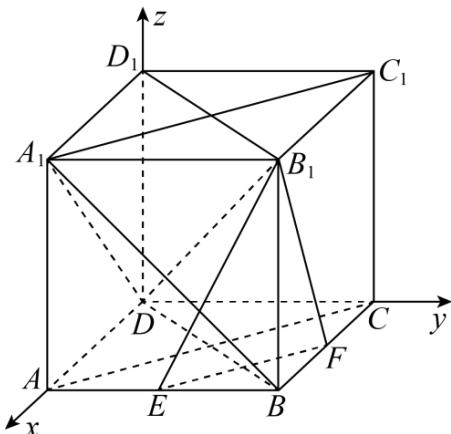

选项 BCD 解法二：

解：对于选项 $^{B}$ ，如图所示，设 $A_{1}B \cap B_{1}E = M$ ， $EF \cap BD = N$ ，则 MN 为平面 $B_{1}EF$ 与平面 $A_{1}BD$ 的交线，在 $\triangle BMN$ 内，作 $BP \perp MN$ 于点 P，在 $\triangle EMN$ 内，作 $GP \perp MN$ ，交 EN 于点 G，连结 BG，

则 $\angle BPG$ 或其补角为平面 $B_{1}EF$ 与平面 $A_{1}BD$ 所成二面角的平面角，

由勾股定理可知： $PB^{2} + PN^{2} = BN^{2}$ ， $PG^{2} + PN^{2} = GN^{2}$

底面正方形ABCD中， $E,F$ 为中点，则 $EF\perp BD$

由勾股定理可得 $NB^{2} + NG^{2} = BG^{2}$

从而有： $NB^{2} + NG^{2} = (PB^{2} + PN^{2}) + (PG^{2} + PN^{2}) = BG^{2}$

据此可得 $PB^{2} + PG^{2}\neq BG^{2}$ ，即 $\angle BPG\neq 90^{\circ}$

据此可得平面 $B_{1}EF \perp$ 平面 $A_{1}BD$ 不成立，选项 B 错误；

对于选项 C，取 $A_{1}B_{1}$ 的中点 H，则 $AH \parallel B_{1}E$

由于 AH 与平面 $A_{1}AC$ 相交，故平面 $B_{1}EF\parallel$ 平面 $A_{1}AC$ 不成立，选项 C 错误；

对于选项 $^{D}$ ，取AD的中点M，很明显四边形 $A_{1}B_{1}FM$ 为平行四边形，则 $A_{1}M\parallel B_{1}F$ ，由于 $A_{1}M$ 与平面 $A_{1}C_{1}D$ 相交，故平面 $B_{1}EF\parallel$ 平面 $A_{1}C_{1}D$ 不成立，选项 $^{D}$ 错误；

故选：A.

4．（2021·浙江·高考真题）如图已知正方体 $ABCD-A_{1}B_{1}C_{1}D_{1}$ ，M，N 分别是 $A_{1}D$ ， $D_{1}B$ 的中点，则（）

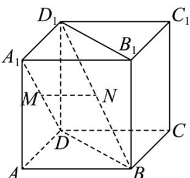

A. 直线 $A_{1}D$ 与直线 $D_{1}B$ 垂直，直线 $MN \parallel$ 平面 $ABCD$

B．直线 $A_{1}D$ 与直线 $D_{1}B$ 平行，直线 $MN \perp$ 平面 $BDD_{1}B_{1}$

C. 直线 $A_{1}D$ 与直线 $D_{1}B$ 相交，直线 $MN //$ 平面 $ABCD$

D．直线 $A_{1}D$ 与直线 $D_{1}B$ 异面，直线 $MN \perp$ 平面 $BDD_{1}B_{1}$

【答案】A

【分析】由正方体间的垂直、平行关系，可证 $MN//AB, A_1D \perp$ 平面 $ABD_1$ ，即可得出结论

【详解】

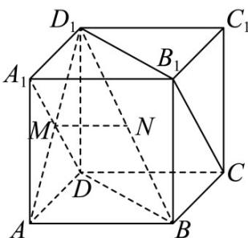

连 $AD_{1}$ ，在正方体 $ABCD - A_{1}B_{1}C_{1}D_{1}$ 中， $M$ 是 $A_{1}D$ 的中点，所以 $M$ 为 $AD_{1}$ 中点，  
又 $N$ 是 $D_{1}B$ 的中点，所以 $MN//AB$ ， $MN\not\subset$ 平面 $ABCD,AB\subset$ 平面 $ABCD$ ，  
所以 $MN//$ 平面 $ABCD$ ·  
因为 $AB$ 不垂直 $BD$ ，所以 $MN$ 不垂直 $BD$ 则 $MN$ 不垂直平面 $BDD_{1}B_{1}$ ，所以选项 B,D 不正确；  
在正方体 $ABCD - A_{1}B_{1}C_{1}D_{1}$ 中， $AD_{1}\bot A_{1}D$ ， $AB\bot$ 平面 $AA_{1}D_{1}D$ ，所以 $AB\bot A_{1}D$ ， $AD_{1}\cap AB = A$ ，所以 $A_{1}D\bot$ 平面 $ABD_{1}$ ， $D_{1}B\subset$ 平面 $ABD_{1}$ ，所以 $A_{1}D\bot D_{1}B$ ，  
且直线 $A_{1}D,D_{1}B$ 是异面直线，  
所以选项 C 错误，选项 A 正确·

故选：A.

【点睛】关键点点睛：熟练掌握正方体中的垂直、平行关系是解题的关键，如两条棱平行或垂直，同一个面对角线互相垂直，正方体的对角线与面的对角线是相交但不垂直或异面垂直关系·

5. (2021·全国新Ⅱ卷·高考真题)（多选）如图，在正方体中，O为底面的中心，P为所在棱的中点，M，N为正方体的顶点．则满足 $MN \perp OP$ 的是（）

A.  
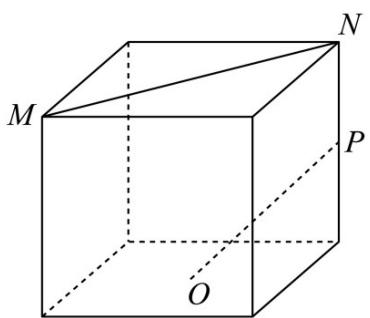

B  
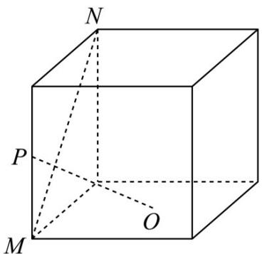

C  
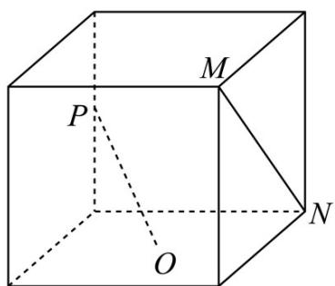

D  
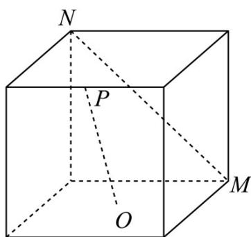

【答案】BC

【分析】根据线面垂直的判定定理可得 BC 的正误，平移直线 MN 构造所考虑的线线角后可判断 AD 的正误。
【详解】设正方体的棱长为 2，

对于 $^{A}$ ，如图（1）所示，连接AC，则MN//AC

故 $\angle POC$ （或其补角）为异面直线 $OP, MN$ 所成的角，

在直角三角形 $OPC$ ， $OC = \sqrt{2}$ ， $CP = 1$ ，故 $\tan \angle POC = \frac{1}{\sqrt{2}} = \frac{\sqrt{2}}{2}$

故 $MN \perp OP$ 不成立，故 $^{A}$ 错误.

  
图(1)

对于 $^{B}$ ，如图（2）所示，取NT的中点为Q，连接PQ，OQ，则 $OQ \perp NT$ ， $PQ \perp MN$ 由正方体 SBCM-NADT 可得 $SN \perp$ 平面 ANDT，而 $OQ \subset$ 平面 ANDT，
故 $SN \perp OQ$ ，而 $SN \cap MN = N$ ，故 $OQ \perp$ 平面 SNTM，
又 $MN \subset$ 平面 SNTM， $OQ \perp MN$ ，而 $OQ \cap PQ = Q$ ，

所以 $MN \perp$ 平面 OPQ，而 $PO \subset$ 平面 OPQ，故 $MN \perp OP$ ，故 B 正确.

  
图(2)

对于 $^{C}$ ，如图（ $^{3}$ ），连接BD，则 $BD//MN$ ，由 $^{B}$ 的判断可得 $OP\perp BD$ ，故 $OP\perp MN$ ，故 $^{C}$ 正确·

  
图(3)

对于 $^{D}$ ，如图（ $^{4}$ ），取AD的中点Q，AB的中点K，连接AC,PQ,OQ,PK,OK，则AC//MN，

因为 DP = PC ，故 $PQ \parallel AC$ ，故 $PQ \parallel MN$ ，

所以 $\angle QPO$ 或其补角为异面直线 PO, MN 所成的角，

  
图(4)

因为正方体的棱长为 $^{2}$ ，故 $PQ = \frac{1}{2} AC = \sqrt{2}$ ， $OQ = \sqrt{AO^2 + AQ^2} = \sqrt{1 + 2} = \sqrt{3}$ ，

$PO = \sqrt{PK^{2} + OK^{2}} = \sqrt{4 + 1} = \sqrt{5}$ ， $QO^{2} < PQ^{2} + OP^{2}$ ，故 $\angle QPO$ 不是直角，

故 $PO, MN$ 不垂直，故 ${}^{\mathrm{D}}$ 错误

故选：BC.

6. (2019·全国·高考真题) 如图, 点 $N$ 为正方形 $ABCD$ 的中心, $\Delta ECD$ 为正三角形, 平面 $ECD \perp$ 平面 $ABCD, M$ 是线段 $ED$ 的中点, 则

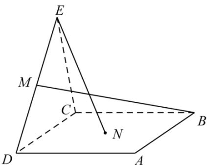

A. $BM = EN$ ，且直线 $BM, EN$ 是相交直线

B. $BM \neq EN$ ，且直线 $BM, EN$ 是相交直线

C. $BM = EN$ ，且直线 $BM, EN$ 是异面直线

D. $BM \neq EN$ ，且直线 $BM, EN$ 是异面直线

【答案】B

【解析】利用垂直关系，再结合勾股定理进而解决问题。

【详解】如图所示，作 $EO \perp CD$ 于O，连接ON，过M作 $MF \perp OD$ 于F。

连 $BF$ ，∵平面 $CDE \perp$ 平面 $ABCD$

$EO \perp CD, EO \subset$ 平面 $CDE$ ，∴ $EO \perp$ 平面 $ABCD$ ， $MF \perp$ 平面 $ABCD$ ，

$\therefore \Delta MFB$ 与 $\Delta EON$ 均为直角三角形．设正方形边长为 $^2$ ，易知 $EO = \sqrt{3}$ ， $ON = 1$ $EN = 2$ ， $MF = \frac{\sqrt{3}}{2}, BF = \frac{5}{2}, \therefore BM = \sqrt{7}$ ． $\therefore BM \neq EN$ ，故选 $^B$ ：

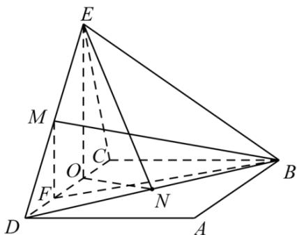

【点睛】本题考查空间想象能力和计算能力，解答本题的关键是构造直角三角形.

7.（2019·全国·高考真题）设 $\alpha$ ， $\beta$ 为两个平面，则 $\alpha // \beta$ 的充要条件是
A. $\alpha$ 内有无数条直线与 $\beta$ 平行
B. $\alpha$ 内有两条相交直线与 $\beta$ 平行
C. $\alpha$ ， $\beta$ 平行于同一条直线
D. $\alpha$ ， $\beta$ 垂直于同一平面

【答案】B

【分析】本题考查了空间两个平面的判定与性质及充要条件，渗透直观想象、逻辑推理素养，利用面面平行的判定定理与性质定理即可作出判断。

【详解】由面面平行的判定定理知： $\alpha$ 内两条相交直线都与 $\beta$ 平行是 $\alpha // \beta$ 的充分条件，由面面平行性质定理知，若 $\alpha // \beta$ ，则 $\alpha$ 内任意一条直线都与 $\beta$ 平行，所以 $\alpha$ 内两条相交直线都与 $\beta$ 平行是 $\alpha // \beta$ 的必要条件，故选B.

【点睛】面面平行的判定问题要紧扣面面平行判定定理，最容易犯的错误为定理记不住，凭主观臆断，如：“若 $a \subset \alpha, b \subset \beta, a // b$ ，则 $\alpha // \beta$ ”此类的错误。

8. (2019·北京·高考真题) 已知 $l$ , $m$ 是平面 $\alpha$ 外的两条不同直线. 给出下列三个论断:

$$
① l \bot m; ② m ^ {\parallel} \alpha ; ③ l \bot \alpha
$$

以其中的两个论断作为条件，余下的一个论断作为结论，写出一个正确的命题：\_\_\_\_。

【答案】如果 $l^{\perp a}$ ， $m^{\parallel a}$ ，则 $l^{\perp m}$ 或如果 $l^{\perp a}$ ， $l^{\perp m}$ ，则 $m^{\parallel a}$ .

【分析】将所给论断，分别作为条件、结论加以分析·

【详解】将所给论断，分别作为条件、结论，得到如下三个命题：

(1) 如果 $l \perp a$ , $m \parallel a$ , 则 $l \perp m \cdot$ 正确;

(2) 如果 $l \perp a$ , $l \perp m$ , 则 $m^{\parallel a}$ . 正确；

(3) 如果 $l \perp m, m^{\parallel a}$ , 则 $l \perp a$ . 不正确, 有可能 $l$ 与 $a$ 斜交、 $l^{\parallel a}$ .

【点睛】本题主要考查空间线面的位置关系、命题、逻辑推理能力及空间想象能力·

9. （2017·全国高考真题）（多选）如图，在下列四个正方体中，A, B 为正方体的两个顶点，M, N, Q 为所在棱的中点，则在这四个正方体中，直线 AB 与平面 MNQ 平行的是（）

A  

B  
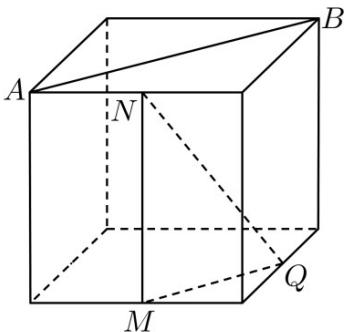

C.  

D  

【答案】BCD

【分析】利用线面平行判定定理逐项判断可得答案.

【详解】对于选项 $^{A}$ ， $OQ\|AB$ ，OQ与平面MNQ是相交的位置关系，故AB和平面MNQ不平行，故 $^{A}$ 错误；

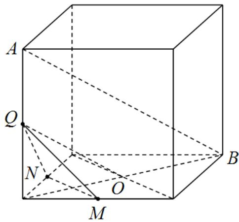

面 MNQ，故 $^{B}$ 正确；

面 MNQ : 故 $^{C}$ 正确 ;

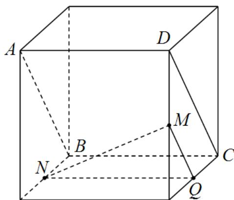

面 MNQ : 故 $^{D}$ 正确 ;

对于选项 $^{B}$ ，由于 $AB\|CD\|MQ$ ，结合线面平行判定定理可知 $AB\|$ 平

对于选项 $^{C}$ ，由于 $AB\|CD\|MQ$ ，结合线面平行判定定理可知 $AB\|$ 平

对于选项 $^{D}$ ，由于 $AB\|CD\|NQ$ ，结合线面平行判定定理可知 $AB\|$ 平

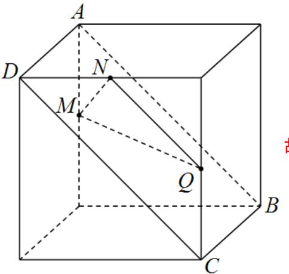

故选：BCD

10. (2016·浙江·高考真题) 已知互相垂直的平面 $\alpha, \beta$ 交于直线 $l$ . 若直线 $m, n$ 满足 $m \parallel \alpha, n \perp \beta$ , 则
A. $m \parallel l$ B. $m \parallel n$ C. $n \perp l$ D. $m \perp n$

【答案】C

【详解】试题分析：

由题意知 $\alpha\cap\beta=l,\therefore l\subset\beta$ ，∵ $n\perp\beta,\therefore n\perp l$ 。故选 C 。

【考点】空间点、线、面的位置关系.

【思路点睛】解决这类空间点、线、面的位置关系问题，一般是借助长方体（或正方体），能形象直观地看出空间点、线、面的位置关系。

11. (2016·山东·高考真题) 已知直线 $a, b$ 分别在两个不同的平面 $\alpha, \beta$ 内·则“直线 $a$ 和直线 $b$ 相交”是“平面 $\alpha$ 和平面 $\beta$ 相交”的( )

A. 充分不必要条件

B. 必要不充分条件

C. 充要条件

D. 既不充分也不必要条件

【答案】A

【详解】当“直线 $a$ 和直线 $b$ 相交”时，平面 $\alpha$ 和平面 $\beta$ 必有公共点，即平面 $\alpha$ 和平面 $\beta$ 相交，充分性成立；当“平面 $\alpha$ 和平面 $\beta$ 相交”，则“直线 $a$ 和直线 $b$ 可以没有公共点”，即必要性不成立。故选A.

12. (2016·全国·高考真题) $\alpha$ 、 $\beta$ 是两个平面， $m$ 、 $n$ 是两条直线，有下列四个命题：(1) 如果 $m^{\perp}n$ ， $m^{\perp}\alpha$ ， $n^{\parallel}\beta$ ，那么 $\alpha^{\perp}\beta$ 。(2) 如果 $m^{\perp}\alpha$ ， $n^{\parallel}\alpha$ ，那么 $m^{\perp}n$ 。

(3) 如果 $\alpha^{\parallel}\beta, m\subset\alpha$ ，那么 $m^{\parallel}\beta\cdot\quad(4)$ 如果 $m^{\parallel}n, \alpha^{\parallel}\beta$ ，那么 $m$ 与 $\alpha$ 所成的角和 $n$ 与 $\beta$ 所成的角相等。其中正确的命题有\_\_\_\_（填写所有正确命题的编号）

【答案】②③④

【详解】试题分析：：①如果 $m \perp n$ ， $m \perp \alpha$ ， $n \parallel \beta$ ，不能得出 $\alpha \perp \beta$ ，故错误；

②如果 $n \parallel a$ ，则存在直线 $l \subset a$ ，使 $n \parallel l$ ，由 $m \perp a$ ，可得 $m \perp l$ ，那么 $m \perp n$ 。故正确；

③如果 $\alpha\beta$ , $m\subset\alpha$ ，那么 m 与 $\beta$ 无公共点，则 $m\beta$ 。故正确

④如果 $m \mid n$ ， $\alpha \mid \beta$ ，那么 $m$ ， $n$ 与 $\alpha$ 所成的角和 $m$ ， $n$ 与 $\beta$ 所成的角均相等．故正确

考点：命题的真假判断与应用；空间中直线与直线之间的位置关系；空间中直线与平面之间的位置关系
13．（2015·浙江·高考真题）设 $\alpha$ ， $\beta$ 是两个不同的平面，l，m 是两条不同的直线，且 $l \subset \alpha$ ， $m \subset \beta$ A. 若 $l \perp \beta$ ，则 $\alpha \perp \beta$ B. 若 $\alpha \perp \beta$ ，则 $l \perp m$ C. 若 $l // \beta$ ，则 $\alpha // \beta$ D. 若 $\alpha // \beta$ ，则 $l // m$

【答案】A

【详解】试题分析：由面面垂直的判定定理：如果一个平面经过另一平面的一条垂线，则两面垂直，可得 $l \perp \beta, l \subset \alpha$ 可得 $\alpha \perp \beta$

考点：空间线面平行垂直的判定与性质

14. (2015·湖北·高考真题) $l_{1}, l_{2}$ 表示空间中的两条直线，若 $\mathfrak{p}: l_{1}, l_{2}$ 是异面直线； $\mathfrak{q}: l_{1}, l_{2}$ 不相交，则 A. $\mathfrak{p}$ 是 $\mathfrak{q}$ 的充分条件，但不是 $\mathfrak{q}$ 的必要条件 B. $\mathfrak{p}$ 是 $\mathfrak{q}$ 的必要条件，但不是 $\mathfrak{q}$ 的充分条件 C. $\mathfrak{p}$ 是 $\mathfrak{q}$ 的充分必要条件 D. $\mathfrak{p}$ 既不是 $\mathfrak{q}$ 的充分条件，也不是 $\mathfrak{q}$ 的必要条件

【答案】A

【详解】若 $p: l_1, l_2$ 是异面直线，由异面直线的定义知， $l_1, l_2$ 不相交，所以命题 $q: l_1, l_2$ 不相交成立，即 $p$ 是 $q$ 的充分条件；反过来，若 $q: l_1, l_2$ 不相交，则 $l_1, l_2$ 可能平行，也可能异面，所以不能推出 $l_1, l_2$ 是异面直线，即 $p$ 不是 $q$ 的必要条件，故应选 A．

考点：本题考查充分条件与必要条件、异面直线，属基础题.

15. (2015·广东·高考真题) 若直线 $l_{1}$ 和 $l_{2}$ 是异面直线， $l_{1}$ 在平面 $\alpha$ 内， $l_{2}$ 在平面 $\beta$ 内， $|$ 是平面 $\alpha$ 与平面 $\beta$ 的交线，则下列命题正确的是
A. $l$ 与 $l_{1}, l_{2}$ 都相交
B. $l$ 与 $l_{1}, l_{2}$ 都不相交
C. $l$ 至少与 $l_{1}, l_{2}$ 中的一条相交
D. $l$ 至多与 $l_{1}, l_{2}$ 中的一条相交

【答案】C

【详解】l 与 $l_{1}$ ， $l_{2}$ 可以都相交，可可能和其中一条平行，和其中一条相交，如图

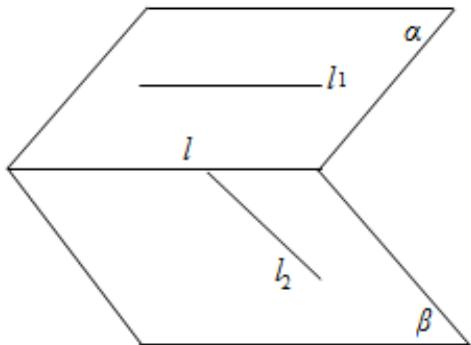

所以 l 至少与 $l_{1}$ ， $l_{2}$ 中的一条相交。
故选:C.

16. (2015·福建·高考真题) 若 $l, m$ 是两条不同的直线， $m$ 垂直于平面 $\alpha$ ，则“ $l \perp m$ ”是“ $l // \alpha$ ”的
A．充分而不必要条件
B．必要而不充分条件
C．充分必要条件
D．既不充分也不必要条件

【答案】B

【详解】若 $l \perp m$ ，因为 $m$ 垂直于平面 $\alpha$ ，则 $l // \alpha$ 或 $l \subset \alpha$ ；若 $l // \alpha$ ，又 $m$ 垂直于平面 $\alpha$ ，则 $l \perp m$ ，所以“ $l \perp m$ ”是“ $l // \alpha$ ”的必要不充分条件，故选 B.

考点：空间直线和平面、直线和直线的位置关系.

17. (2015·北京·高考真题) 设 $\alpha$ , $\beta$ 是两个不同的平面, $m$ 是直线且 $m \subset \alpha$ . “ $m \parallel \beta$ ”是“ $\alpha \parallel \beta$ ”的
A. 充分而不必要条件
B. 必要而不充分条件
C. 充分必要条件
D. 既不充分也不必要条件

【答案】B

【详解】试题分析： $m \subset \alpha$ ， $m \parallel \beta$ 得不到 $\alpha \parallel \beta$ ，因为 $\alpha, \beta$ 可能相交，只要 $m$ 和 $\alpha, \beta$ 的交线平行即可得到 $m \parallel \beta$ ； $\alpha \parallel \beta$ ， $m \subset \alpha$ ， $\therefore m$ 和 $\beta$ 没有公共点， $\therefore m \parallel \beta$ ，即 $\alpha \parallel \beta$ 能得到 $m \parallel \beta$ ； $\because m \parallel \beta$ 是“ $\alpha \parallel \beta$ ”的必要不充分条件．故选 B．

## 考点：必要条件、充分条件与充要条件的判断·

【方法点睛】考查线面平行的定义，线面平行的判定定理，面面平行的定义，面面平行的判定定理，以及充分条件、必要条件，及必要不充分条件的概念，属于基础题； $m \parallel \beta$ 并得不到 $\alpha \parallel \beta$ ，根据面面平行的判定定理，只有 $\alpha$ 内的两相交直线都平行于 $\beta$ ，而 $\alpha \parallel \beta$ ，并且 $m \subset \alpha$ ，显然能得到 $m \parallel \beta$ ，这样即可找出正确选项。

![[高中/真题/按题型分类/专题11 立体几何基本概念与计算小题综合/考点02_求几何体的体积/考点02_求几何体的体积.md]]
