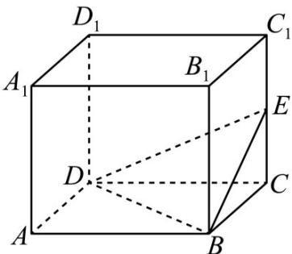

<!-- question-source:start -->
20．（2019·江苏·高考真题）如图，长方体 $ABCD - A_1B_1C_1D_1$ 的体积是 $120$ ， $E$ 为 $CC_1$ 的中点，则三棱锥 $E-$ BCD的体积是\_\_\_\_.

<!-- question-source:end -->

![[高中/真题/按题型分类/专题11 立体几何基本概念与计算小题综合/考点02_求几何体的体积/对点训练/answers/Q00054839A1.md]]
