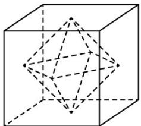

<!-- question-source:start -->
23.（2018·江苏·高考真题）如图所示，正方体的棱长为 $^{2}$ ，以其所有面的中心为顶点的多面体的体积为\_\_\_\_。

<!-- question-source:end -->

![[高中/真题/按题型分类/专题11 立体几何基本概念与计算小题综合/考点02_求几何体的体积/对点训练/answers/Q00054841A1.md]]
