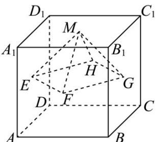

<!-- question-source:start -->
25. (2018·天津高考真题) 已知正方体 $ABCD - A_1B_1C_1D_1$ 的棱长为 1，除面 $ABCD$ 外，该正方体其余各面的中心分别为点 $E, F, G, H, M$ （如图），则四棱锥 $M - EFGH$ 的体积为 \_\_\_\_.

<!-- question-source:end -->

![[高中/真题/按题型分类/专题11 立体几何基本概念与计算小题综合/考点02_求几何体的体积/对点训练/answers/Q00054843A1.md]]
