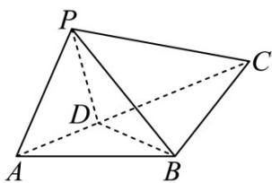

<!-- question-source:start -->
28.（2016·浙江·高考真题）如图，在△ABC中， $AB=BC=2$ ， $\angle ABC=120^{\circ}$ ·若平面ABC外的点P和线段AC上的点D，满足PD=DA，PB=BA，则四面体PBCD的体积的最大值是\_\_\_\_。

<!-- question-source:end -->

![[高中/真题/按题型分类/专题11 立体几何基本概念与计算小题综合/考点02_求几何体的体积/对点训练/answers/Q00054845A1.md]]
