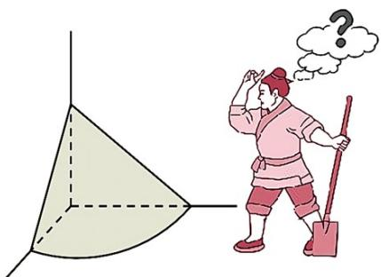

<!-- question-source:start -->
31．（2015·全国·高考真题）(2015 新课标全国 $^{1}$ 理科)《九章算术》是我国古代内容极为丰富的数学名著，书中有如下问题：“今有委米依垣内角，下周八尺，高五尺·问：积及为米几何？”其意思为：“在屋内墙角处堆放米（如图，米堆为一个圆锥的四分之一），米堆底部的弧长为 $^{8}$ 尺，米堆的高为 $^{5}$ 尺，问米堆的体积和堆放的米各为多少？”已知 $^{1}$ 斛米的体积约为 $^{1.62}$ 立方尺，圆周率约为 $^{3}$ ，估算出堆放的米约有

A.14 斛 B.22 斛 C.36 斛 D.66 斛
<!-- question-source:end -->

![[高中/真题/按题型分类/专题11 立体几何基本概念与计算小题综合/考点02_求几何体的体积/对点训练/answers/Q00054848A1.md]]
