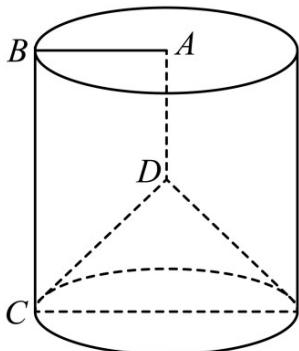

> [!faq]- 《zhenti-专题11 立体几何基本概念与计算小题综合》例题解析
>
> > [!success]- **【答案】** C
>
> > [!note]- **【解析】**
> > 
> >
> > 由题意可知旋转后的几何体如图:
> >
> > 直角梯形ABCD绕AD所在的直线旋转一周而形成的曲面所围成的几何体是一个底面半径为 $^{1}$ ，母线长为 $^{2}$ 的圆柱挖去一个底面半径同样是 $^{1}$ 、高为 $^{1}$ 的圆锥后得到的组合体，所以该组合体的体积为 $V = V_{圆柱} - V_{圆锥} = \pi \times 1^{2} \times 2 - \frac{1}{3} \times \pi \times 1^{2} \times 1 = \frac{5}{3}\pi$
> >
> > 故选 C.
> >
> > 考点： $^{1}$ 、空间几何体的结构特征； $^{2}$ 、空间几何体的体积·
> >
> > ## 考点 03 求几何体的侧面积、表面积
