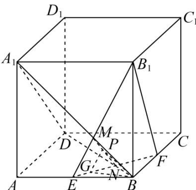
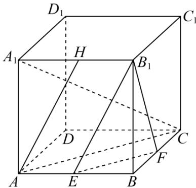
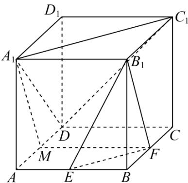

> [!faq]- 《专题11 立体几何的基本概念、点线面位置关系及表面积、体积的计算小题综合》真题解析
>
> > [!success]- **【答案】** A
>
> > [!note]- **【分析】**
> > 证明 $EF \perp$ 平面 $BDD_{1}$ ，即可判断 A；如图，以点 D 为原点，建立空间直角坐标系，设 AB = 2，分别求出平面 $B_{1}EF$ ， $A_{1}BD$ ， $A_{1}C_{1}D$ 的法向量，根据法向量的位置关系，即可判断 BCD.
>
> > [!note]- **【解析】**
> > 解：在正方体 $ABCD - A_{1}B_{1}C_{1}D_{1}$ 中， $AC \perp BD$ 且 $DD_{1} \perp$ 平面 $ABCD$ ，又 $EF \subset$ 平面 $ABCD$ ，所以 $EF \perp DD_{1}$ ，因为 $E, F$ 分别为 $AB, BC$ 的中点，所以 $EF \parallel AC$ ，所以 $EF \perp BD$ ，
> > 又 $BD \cap DD_{1} = D$
> > 所以 $EF \perp$ 平面 $BDD_{1}$ ，
> > 又 $EF \subset$ 平面 $B_{1}EF$
> > 所以平面 $B_{1}EF \perp$ 平面 $BDD_{1}$ ，故 $\mathsf{A}$ 正确；
> > 选项 BCD 解法一：
> > 如图，以点 D 为原点，建立空间直角坐标系，设 AB = 2 ，
> > 则 $B_{1}(2,2,2),E(2,1,0),F(1,2,0),B(2,2,0),A_{1}(2,0,2),A(2,0,0),C(0,2,0)$
> > $$
> > C _ {1} (0, 2, 2)
> > $$
> > 则 $EF = (-1,1,0)$ , $EB_{1} = (0,1,2)$ , $DB = (2,2,0)$ , $DA_{1} = (2,0,2)$ ,
> > $$
> > \stackrel {{\sqcup \sqcup \sqcup}} {{A A _ {1}}} = (0, 0, 2), \stackrel {{\sqcup \sqcup \sqcup}} {{A C}} = (- 2, 2, 0), \stackrel {{\sqcup \sqcup \sqcup \sqcup}} {{A _ {1} C _ {1}}} = (- 2, 2, 0),
> > $$
> > 设平面 $B_{1}EF$ 的法向量为 $m=(x_{1},y_{1},z_{1})$
> > 则有 $\left\{ \begin{array}{l} m \cdot \overline{EE} = -x_1 + y_1 = 0 \\ m \cdot EB_1 = y_1 + 2z_1 = 0 \end{array} \right.$ ，可取 $m = (2, 2, -1)$ ，
> > 同理可得平面 $A_{1}BD$ 的法向量为 $n_{1}=\left(1,-1,-1\right)$
> > 平面 $A_{1}AC$ 的法向量为 $n_{2} = (1,1,0)$
> > 平面 $A_{1}C_{1}D$ 的法向量为 $\overline{n_3} = (1,1, - 1)$
> > 则 $m \cdot n_{1} = 2 - 2 + 1 = 1 \neq 0$
> > 所以平面 $B_{1}EF$ 与平面 $A_{1}BD$ 不垂直，故 B 错误；
> > 因为 $m$ 与 $n_2$ 不平行，
> > 所以平面 $B_{1}EF$ 与平面 $A_{1}AC$ 不平行，故 C 错误；
> > 因为 $m$ 与 $n_3$ 不平行，
> > 所以平面 $B_{1}EF$ 与平面 $A_{1}C_{1}D$ 不平行，故 $\mathsf{D}$ 错误，
> > 故选：A.
> > 
> > 选项 BCD 解法二：
> > 解：对于选项 $^{B}$ ，如图所示，设 $A_{1}B \cap B_{1}E = M$ ， $EF \cap BD = N$ ，则 MN 为平面 $B_{1}EF$ 与平面 $A_{1}BD$ 的交线，在 $\triangle BMN$ 内，作 $BP \perp MN$ 于点 P，在 $\triangle EMN$ 内，作 $GP \perp MN$ ，交 EN 于点 G，连结 BG，
> > 则 $\angle BPG$ 或其补角为平面 $B_{1}EF$ 与平面 $A_{1}BD$ 所成二面角的平面角，
> > 
> > 由勾股定理可知： $PB^{2} + PN^{2} = BN^{2}$ ， $PG^{2} + PN^{2} = GN^{2}$
> > 底面正方形ABCD中， $E,F$ 为中点，则 $EF\perp BD$
> > 由勾股定理可得 $NB^{2} + NG^{2} = BG^{2}$
> > 从而有： $NB^{2} + NG^{2} = (PB^{2} + PN^{2}) + (PG^{2} + PN^{2}) = BG^{2}$
> > 据此可得 $PB^{2} + PG^{2}\neq BG^{2}$ ，即 $\angle BPG\neq 90^{\circ}$
> > 据此可得平面 $B_{1}EF \perp$ 平面 $A_{1}BD$ 不成立，选项 B 错误；
> > 对于选项 C，取 $A_{1}B_{1}$ 的中点 H，则 $AH \parallel B_{1}E$
> > 由于 AH 与平面 $A_{1}AC$ 相交，故平面 $B_{1}EF\parallel$ 平面 $A_{1}AC$ 不成立，选项 C 错误；
> > 
> > 对于选项 $^{D}$ ，取AD的中点M，很明显四边形 $A_{1}B_{1}FM$ 为平行四边形，则 $A_{1}M\parallel B_{1}F$ ，由于 $A_{1}M$ 与平面 $A_{1}C_{1}D$ 相交，故平面 $B_{1}EF\parallel$ 平面 $A_{1}C_{1}D$ 不成立，选项 $^{D}$ 错误；
> > 
> >
> > 故选 **A**.
