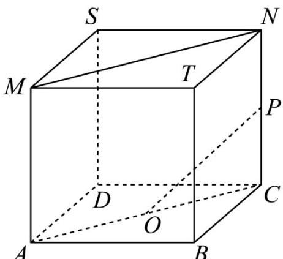
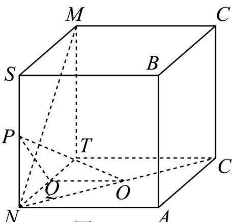
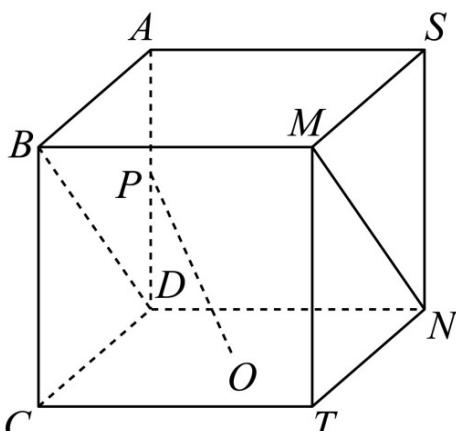
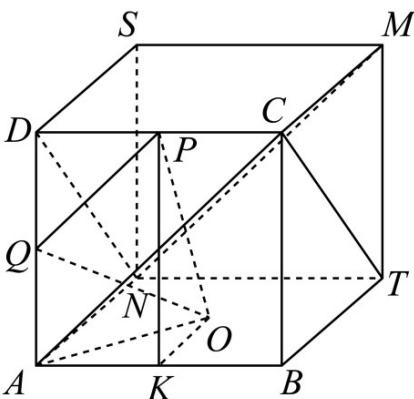

> [!faq]- 《专题11 立体几何的基本概念、点线面位置关系及表面积、体积的计算小题综合》真题解析
>
> > [!success]- **【答案】** BC
>
> > [!note]- **【分析】**
> > 根据线面垂直的判定定理可得 BC 的正误，平移直线 MN 构造所考虑的线线角后可判断 AD 的正误。
>
> > [!note]- **【解析】**
> > 设正方体的棱长为 2，
> > 对于 $^{A}$ ，如图（1）所示，连接AC，则MN//AC
> > 故 $\angle POC$ （或其补角）为异面直线 $OP, MN$ 所成的角，
> > 在直角三角形 $OPC$ ， $OC = \sqrt{2}$ ， $CP = 1$ ，故 $\tan \angle POC = \frac{1}{\sqrt{2}} = \frac{\sqrt{2}}{2}$
> > 故 $MN \perp OP$ 不成立，故 $^{A}$ 错误.
> > 
> > 图(1)
> > 对于 $^{B}$ ，如图（2）所示，取NT的中点为Q，连接PQ，OQ，则 $OQ \perp NT$ ， $PQ \perp MN$ 由正方体 SBCM-NADT 可得 $SN \perp$ 平面 ANDT，而 $OQ \subset$ 平面 ANDT，
> > 故 $SN \perp OQ$ ，而 $SN \cap MN = N$ ，故 $OQ \perp$ 平面 SNTM，
> > 又 $MN \subset$ 平面 SNTM， $OQ \perp MN$ ，而 $OQ \cap PQ = Q$ ，
> > 所以 $MN \perp$ 平面 OPQ，而 $PO \subset$ 平面 OPQ，故 $MN \perp OP$ ，故 B 正确.
> > 
> > 图(2)
> > 对于 $^{C}$ ，如图（ $^{3}$ ），连接BD，则 $BD//MN$ ，由 $^{B}$ 的判断可得 $OP\perp BD$ ，故 $OP\perp MN$ ，故 $^{C}$ 正确·
> > 
> > 图(3)
> > 对于 $^{D}$ ，如图（ $^{4}$ ），取AD的中点Q，AB的中点K，连接AC,PQ,OQ,PK,OK，则AC//MN，
> > 因为 DP = PC ，故 $PQ \parallel AC$ ，故 $PQ \parallel MN$ ，
> > 所以 $\angle QPO$ 或其补角为异面直线 PO, MN 所成的角，
> > 
> > 图(4)
> > 因为正方体的棱长为 $^{2}$ ，故 $PQ = \frac{1}{2} AC = \sqrt{2}$ ， $OQ = \sqrt{AO^2 + AQ^2} = \sqrt{1 + 2} = \sqrt{3}$ ，
> > $PO = \sqrt{PK^{2} + OK^{2}} = \sqrt{4 + 1} = \sqrt{5}$ ， $QO^{2} < PQ^{2} + OP^{2}$ ，故 $\angle QPO$ 不是直角，
> > 故 $PO, MN$ 不垂直，故 ${}^{\mathrm{D}}$ 错误
> >
> > 故选 **BC**.
