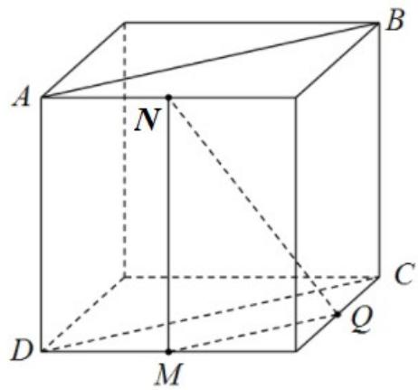

> [!faq]- 《专题11 立体几何的基本概念、点线面位置关系及表面积、体积的计算小题综合》真题解析
>
> > [!success]- **【答案】** BCD
>
> > [!note]- **【分析】**
> > 利用线面平行判定定理逐项判断可得答案.
>
> > [!note]- **【解析】**
> > 对于选项 $^{A}$ ， $OQ\|AB$ ，OQ与平面MNQ是相交的位置关系，故AB和平面MNQ不平行，故 $^{A}$ 错误；
> > 
> > 面 MNQ，故 $^{B}$ 正确；
> > 
> > 面 MNQ : 故 $^{C}$ 正确 ;
> > 
> > 面 MNQ : 故 $^{D}$ 正确 ;
> > 对于选项 $^{B}$ ，由于 $AB\|CD\|MQ$ ，结合线面平行判定定理可知 $AB\|$ 平
> > 对于选项 $^{C}$ ，由于 $AB\|CD\|MQ$ ，结合线面平行判定定理可知 $AB\|$ 平
> > 对于选项 $^{D}$ ，由于 $AB\|CD\|NQ$ ，结合线面平行判定定理可知 $AB\|$ 平
> > 
> >
> > 故选 **BCD**
