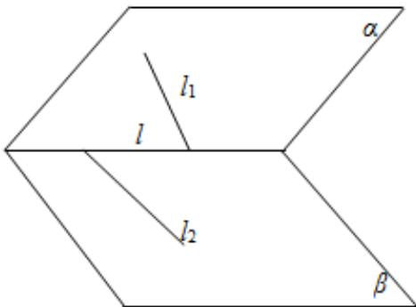

> [!faq]- 《专题11 立体几何的基本概念、点线面位置关系及表面积、体积的计算小题综合》真题解析
>
> > [!success]- **【答案】** C
>
> > [!note]- **【分析】**
> > 本题未单列分析。
>
> > [!note]- **【解析】**
> > 【答案】C
> > 【详解】l 与 $l_{1}$ ， $l_{2}$ 可以都相交，可可能和其中一条平行，和其中一条相交，如图
> > 
> > 
> > 所以 l 至少与 $l_{1}$ ， $l_{2}$ 中的一条相交。
> >
> > 故选 **C**.
