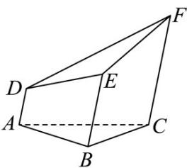

<!-- question-source:start -->
2．（2024·天津高考真题）一个五面体 $ABC-DEF$ ．已知 $AD\parallel BE\parallel CF$ ，且两两之间距离为 1．并已知 $AD=1, BE=2, CF=3$ ．则该五面体的体积为（）

A. $\frac{\sqrt{3}}{6}$ B. $\frac{3\sqrt{3}}{4} +\frac{1}{2}$ C. $\frac{\sqrt{3}}{2}$ D. $\frac{3\sqrt{3}}{4} -\frac{1}{2}$
<!-- question-source:end -->

![[高中/真题/按题型分类/专题11 立体几何的基本概念、点线面位置关系及表面积、体积的计算小题综合/考点02_求几何体的体积/真题/answers/Q00034182A1.md]]
