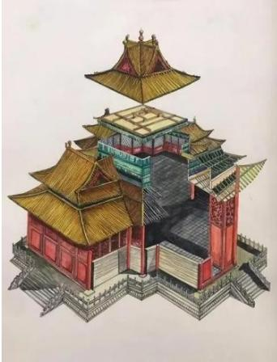
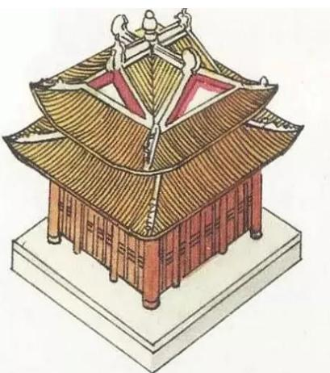

<!-- question-source:start -->
11．（2022·天津·高考真题）如图，“十字歇山”是由两个直三棱柱重叠后的景象，重叠后的底面为正方形，直三棱柱的底面是顶角为 $120^{\circ}$ ，腰为 $^{3}$ 的等腰三角形，则该几何体的体积为（）

A 23 B 24 C 26 D 27
<!-- question-source:end -->

![[高中/真题/按题型分类/专题11 立体几何的基本概念、点线面位置关系及表面积、体积的计算小题综合/考点02_求几何体的体积/真题/answers/Q00034191A1.md]]
