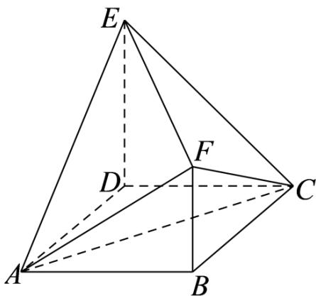

<!-- question-source:start -->
14．（2022·全国新Ⅱ卷·高考真题）如图，四边形ABCD为正方形， $ED \perp$ 平面ABCD， $FB\parallel ED, AB = ED = 2FB$ ，记三棱锥 E-ACD，F-ABC，F-ACE 的体积分别为 $V_{1}, V_{2}, V_{3}$ ，则（）

A. $V_{3} = 2V_{2}$ B. $V_{3} = V_{1}$ C. $V_{3} = V_{1} + V_{2}$ D. $2V_{3} = 3V_{1}$
<!-- question-source:end -->

![[高中/真题/按题型分类/专题11 立体几何的基本概念、点线面位置关系及表面积、体积的计算小题综合/考点02_求几何体的体积/真题/answers/Q00034194A1.md]]
