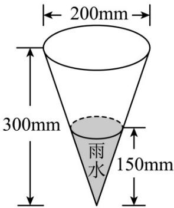

<!-- question-source:start -->
16. （2021·北京·高考真题）某一时间段内，从天空降落到地面上的雨水，未经蒸发、渗漏、流失而在水平面上积聚的深度，称为这个时段的降雨量（单位：mm）。24h 降雨量的等级划分如下：

<table><tr><td>等级</td><td>24h降雨量(精确到0.1)</td></tr><tr><td>......</td><td>......</td></tr><tr><td>小雨</td><td>0.1~9.9</td></tr><tr><td>中雨</td><td>10.0~24.9</td></tr><tr><td>大雨</td><td>25.0~49.9</td></tr><tr><td>暴雨</td><td>50.0~99.9</td></tr><tr><td>......</td><td>......</td></tr></table>

在综合实践活动中，某小组自制了一个底面直径为 $200 \mathrm{~mm}$ ，高为 $300 \mathrm{~mm}$ 的圆锥形雨量器。若一次降雨过程中，该雨量器收集的 $^{24} \mathrm{~h}$ 的雨水高度是 $150 \mathrm{~mm}$ （如图所示），则这 $^{24} \mathrm{~h}$ 降雨量的等级是
A. 小雨 B. 中雨 C. 大雨 D. 暴雨
<!-- question-source:end -->

![[高中/真题/按题型分类/专题11 立体几何的基本概念、点线面位置关系及表面积、体积的计算小题综合/考点02_求几何体的体积/真题/answers/Q00034196A1.md]]
