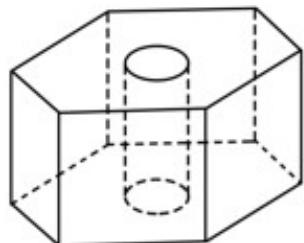

<!-- question-source:start -->
19．（2020·江苏·高考真题）如图，六角螺帽毛坯是由一个正六棱柱挖去一个圆柱所构成的．已知螺帽的底面正六边形边长为 $2 \, cm$ ，高为 $2 \, cm$ ，内孔半径为 $0.5 \, cm$ ，则此六角螺帽毛坯的体积是 \_\_\_\_ $cm^{3}$ .

<!-- question-source:end -->

![[高中/真题/按题型分类/专题11 立体几何的基本概念、点线面位置关系及表面积、体积的计算小题综合/考点02_求几何体的体积/真题/answers/Q00034199A1.md]]
