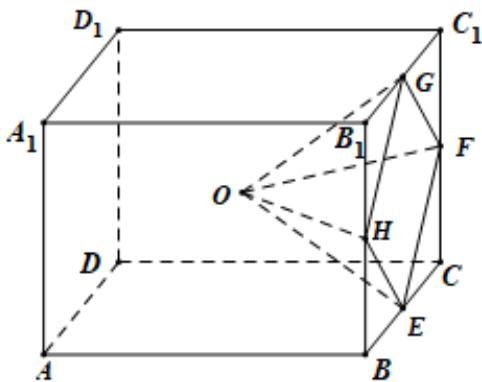

<!-- question-source:start -->
21．（2019·全国·高考真题）学生到工厂劳动实践，利用 $3D$ 打印技术制作模型·如图，该模型为长方体 $ABCD - A_{1}B_{1}C_{1}D_{1}$ 挖去四棱锥 $O - EFGH$ 后所得的几何体，其中 $O$ 为长方体的中心， $E,F,G,H$ 分别为所在棱的中点， $AB = BC = 6\mathrm{cm},AA_{1} = 4\mathrm{cm}$ ，3D打印所用原料密度为 $0.9g / cm^3$ ，不考虑打印损耗，制作该模型所需原料的质量为\_\_\_\_ g.

<!-- question-source:end -->

![[高中/真题/按题型分类/专题11 立体几何的基本概念、点线面位置关系及表面积、体积的计算小题综合/考点02_求几何体的体积/真题/answers/Q00034201A1.md]]
