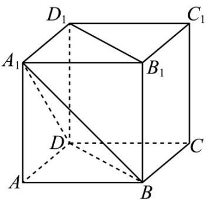

<!-- question-source:start -->
26. (2018·天津·高考真题) 如图, 已知正方体 $ABCD-A_{1}B_{1}C_{1}D_{1}$ 的棱长为 1 , 则四棱锥 $A_{1}-BB_{1}D_{1}D$ 的体积为

<!-- question-source:end -->

![[高中/真题/按题型分类/专题11 立体几何的基本概念、点线面位置关系及表面积、体积的计算小题综合/考点02_求几何体的体积/真题/answers/Q00034205A1.md]]
