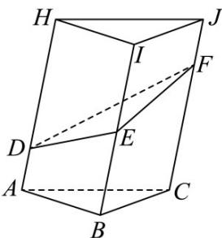

> [!faq]- 《专题11 立体几何的基本概念、点线面位置关系及表面积、体积的计算小题综合》真题解析
>
> > [!success]- **【答案】** C
>
> > [!note]- **【分析】**
> > 【分析】采用补形法，补成一个棱柱，求出其直截面，再利用体积公式即可·
>
> > [!note]- **【解析】**
> > 【详解】用一个完全相同的五面体 HIJ-LMN（顶点与五面体 ABC-DEF 一一对应）与该五面体相嵌，使得 D,N；E,M；F,L 重合，
> > 因为 $AD \parallel BE \parallel CF$ ，且两两之间距离为 1． $AD = 1, BE = 2, CF = 3$
> > 则形成的新组合体为一个三棱柱，
> > 该三棱柱的直截面（与侧棱垂直的截面）为边长为 $^{1}$ 的等边三角形，侧棱长为 $1 + 3 = 2 + 2 = 3 + 1 = 4$
> > $V_{ABC - DEF} = \frac{1}{2} V_{ABC - HIJ} = \frac{1}{2}\times \frac{1}{2}\times 1\times 1\times \frac{\sqrt{3}}{2}\times 4 = \frac{\sqrt{3}}{2}.$
> > 故选：C.
> > 
