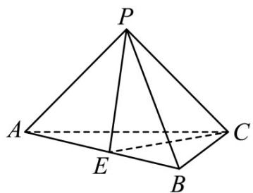

> [!faq]- 《专题11 立体几何的基本概念、点线面位置关系及表面积、体积的计算小题综合》真题解析
>
> > [!success]- **【答案】** A
>
> > [!note]- **【分析】**
> > 【分析】证明 $AB \perp$ 平面 PEC，分割三棱锥为共底面两个小三棱锥，其高之和为 AB 得解。
>
> > [!note]- **【解析】**
> > 【详解】取 AB 中点 E，连接 PE, CE，如图，
> > 
> > # 是边长为 $^{2}$ 的等边三角形，
> > ∵ △ABC
> > ∴ $PE \perp AB, CE \perp AB$ ，又 $PE, CE \subset$ 平面 PEC， $PE \cap CE = E$ ，
> > $\therefore AB \perp$ 平面 $PEC$
> > 又 $PE = CE = 2 \times \frac{\sqrt{3}}{2} = \sqrt{3}$ ， $PC = \sqrt{6}$ ，
> > 故 $PC^2 = PE^2 + CE^2$ ，即 $PE \perp CE$
> > 所以 $V = V_{B - PEC} + V_{A - PEC} = \frac{1}{3} S_{\triangle PEC}\cdot AB = \frac{1}{3}\times \frac{1}{2}\times \sqrt{3}\times \sqrt{3}\times 2 = 1$
> >
> > 故选 **A**
