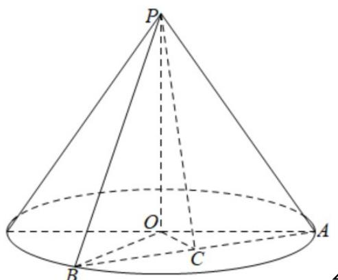

> [!faq]- 《专题11 立体几何的基本概念、点线面位置关系及表面积、体积的计算小题综合》真题解析
>
> > [!success]- **【答案】** B
>
> > [!note]- **【分析】**
> > 根据给定条件，利用三角形面积公式求出圆锥的母线长，进而求出圆锥的高，求出体积作答
>
> > [!note]- **【解析】**
> > 在 $\triangle AOB$ 中， $\angle AOB = 120^{\circ}$ ，而 $OA = OB = \sqrt{3}$ ，取 AB 中点 C，连接 OC, PC，有 $OC \perp AB, PC \perp AB$ ，如图，
> > 
> > ，由的面积为，得
> > $$
> > A B O = 3 0 ^ {\circ}
> > $$
> > $$
> > O C = \frac {\sqrt {3}}{2}, A B = 2 B C = 3
> > $$
> > $$
> > \triangle P A B
> > $$
> > $$
> > \frac {9 \sqrt {3}}{4}
> > $$
> > $$
> > \frac {1}{2} \times 3 \times P C = \frac {9 \sqrt {3}}{4}
> > $$
> > 解得 $PC = \frac{3\sqrt{3}}{2}$ ，于是 $PO = \sqrt{PC^2 - OC^2} = \sqrt{\left(\frac{3\sqrt{3}}{2}\right)^2 - \left(\frac{\sqrt{3}}{2}\right)^2} = \sqrt{6}$
> > 所以圆锥的体积 $V=\frac{1}{3}\pi\times OA^{2}\times PO=\frac{1}{3}\pi\times(\sqrt{3})^{2}\times\sqrt{6}=\sqrt{6}\pi$
> >
> > 故选 **B**
