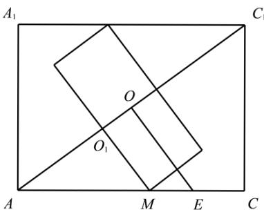

> [!faq]- 《专题11 立体几何的基本概念、点线面位置关系及表面积、体积的计算小题综合》真题解析
>
> > [!success]- **【答案】** ABD
>
> > [!note]- **【分析】**
> > 根据题意结合正方体的性质逐项分析判断·
>
> > [!note]- **【解析】**
> > 对于选项 $^{A}$ ：因为 0.99m < 1m，即球体的直径小于正方体的棱长，
> > 所以能够被整体放入正方体内，故 $^{A}$ 正确；
> > 对于选项 B：因为正方体的面对角线长为 $\sqrt{2}m$ ，且 $\sqrt{2} > 1.4$ ，
> > 所以能够被整体放入正方体内，故 $^{B}$ 正确；
> > 对于选项 C：因为正方体的体对角线长为 $\sqrt{3}m$ ，且 $\sqrt{3}<1.8$ ，
> > 所以不能够被整体放入正方体内，故 $^{C}$ 不正确；
> > 对于选项 D：因为 $1.2 \, m > 1 \, m$ ，可知底面正方形不能包含圆柱的底面圆，
> > 如图，过 $AC_{1}$ 的中点 $O$ 作 $OE \perp AC_{1}$ ，设 $OE \mathrm{I} AC = E$
> > 可知 $AC = \sqrt{2}, CC_{1} = 1, AC_{1} = \sqrt{3}, OA = \frac{\sqrt{3}}{2}$ ，则 $\tan \angle CAC_{1} = \frac{CC_{1}}{AC} = \frac{OE}{AO}$
> > 即 $\frac{1}{\sqrt{2}} = \frac{OE}{\frac{\sqrt{3}}{2}}$ ，解得 $OE = \frac{\sqrt{6}}{4}$
> > 且 $\left(\frac{\sqrt{6}}{4}\right)^2 = \frac{3}{8} = \frac{9}{24} >\frac{9}{25} = 0.6^2$ ，即 $\frac{\sqrt{6}}{4} >0.6$
> > 故以 $AC_{1}$ 为轴可能对称放置底面直径为 1.2m 圆柱，
> > 若底面直径为 $1.2\mathrm{m}$ 的圆柱与正方体的上下底面均相切，设圆柱的底面圆心 $O_{1}$ ，与正方体的下底面的切点为 $M$ ，
> > 可知： $AC_{1}\perp O_{1}M,O_{1}M = 0.6$ ，则 $\tan \angle CAC_1 = \frac{CC_1}{AC} = \frac{O_1M}{AO_1}$
> > 即 $\frac{1}{\sqrt{2}} = \frac{0.6}{AO_1}$ ，解得 $AO_{1} = 0.6\sqrt{2}$
> > 根据对称性可知圆柱的高为 $\sqrt{3} - 2 \times 0.6\sqrt{2} \approx 1.732 - 1.2 \times 1.414 = 0.0352 > 0.01$
> > 所以能够被整体放入正方体内，故 $^{D}$ 正确；
> > 故选：ABD.
> > 
