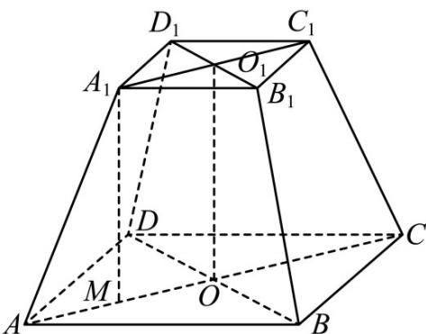

> [!faq]- 《专题11 立体几何的基本概念、点线面位置关系及表面积、体积的计算小题综合》真题解析
>
> > [!success]- **【答案】** $\frac{7\sqrt{6}}{6}/\frac{7}{6}\sqrt{6}$
>
> > [!note]- **【分析】**
> > 结合图像，依次求得 $A_{1}O_{1}, AO, A_{1}M$ ，从而利用棱台的体积公式即可得解
>
> > [!note]- **【解析】**
> > 如图，过 $A_{1}$ 作 $A_{1}M \perp AC$ ，垂足为 $M$ ，易知 $A_{1}M$ 为四棱台 $ABCD - A_{1}B_{1}C_{1}D_{1}$ 的高，
> > 
> > 因为 $AB = 2, A_{1}B_{1} = 1, AA_{1} = \sqrt{2}$
> > 则 $A_{1}O_{1} = \frac{1}{2} A_{1}C_{1} = \frac{1}{2}\times \sqrt{2} A_{1}B_{1} = \frac{\sqrt{2}}{2},AO = \frac{1}{2} AC = \frac{1}{2}\times \sqrt{2} AB = \sqrt{2}$
> > 故 $AM = \frac{1}{2}\left(AC - A_1C_1\right) = \frac{\sqrt{2}}{2}$ ，则 $A_{1}M = \sqrt{A_{1}A^{2} - AM^{2}} = \sqrt{2 - \frac{1}{2}} = \frac{\sqrt{6}}{2}$ ，
> > 所以所求体积为 $V=\frac{1}{3}\times(4+1+\sqrt{4\times1})\times\frac{\sqrt{6}}{2}=\frac{7\sqrt{6}}{6}$ .
> > 故答案为： $\frac{7\sqrt{6}}{6}$
