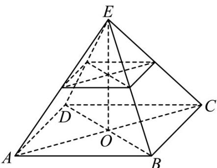

> [!faq]- 《专题11 立体几何的基本概念、点线面位置关系及表面积、体积的计算小题综合》真题解析
>
> > [!success]- **【答案】** 详见解析
>
> > [!note]- **【分析】**
> > 【分析】方法一：割补法，根据正四棱锥的几何性质以及棱锥体积公式求得正确答案；方法二：根据台体的体积公式直接运算求解·
>
> > [!note]- **【解析】**
> > 【详解】方法一：由于 $\frac{2}{4} = \frac{1}{2}$ ，而截去的正四棱锥的高为 $3$ ，所以原正四棱锥的高为 $6$ 。
> > 所以正四棱锥的体积为 $\frac{1}{3} \times (4 \times 4) \times 6 = 32$
> > 截去的正四棱锥的体积为 $\frac{1}{3} \times (2 \times 2) \times 3 = 4$
> > 所以棱台的体积为 $32 - 4 = 28$ 。
> > 方法二：棱台的体积为 $\frac{1}{3}\times3\times\left(16+4+\sqrt{16\times4}\right)=28$ .
> > 故答案为：28.
> > 
