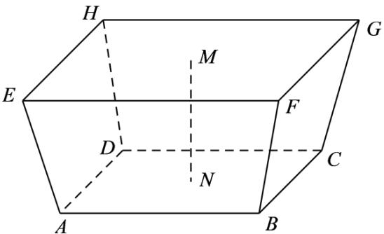

> [!faq]- 《专题11 立体几何的基本概念、点线面位置关系及表面积、体积的计算小题综合》真题解析
>
> > [!success]- **【答案】** C
>
> > [!note]- **【分析】**
> > 根据题意只要求出棱台的高，即可利用棱台的体积公式求出.
>
> > [!note]- **【解析】**
> > 依题意可知棱台的高为 $MN = 157.5 - 148.5 = 9 \, (\text{m})$ ，所以增加的水量即为棱台的体积 V。
> > 棱台上底面积 $S = 140.0 \, km^{2} = 140 \times 10^{6} \, m^{2}$ ，下底面积 $S' = 180.0 \, km^{2} = 180 \times 10^{6} \, m^{2}$ ， $\therefore V = \frac{1}{3} h \left( S + S' + \sqrt{SS'} \right) = \frac{1}{3} \times 9 \times \left( 140 \times 10^{6} + 180 \times 10^{6} + \sqrt{140 \times 180 \times 10^{12}} \right)$ $= 3 \times \left( 320 + 60 \sqrt{7} \right) \times 10^{6} \approx (96 + 18 \times 2.65) \times 10^{7} = 1.437 \times 10^{9} \approx 1.4 \times 10^{9} \, (\text{m}^{3})$
> > 
> >
> > 故选 **C**.
