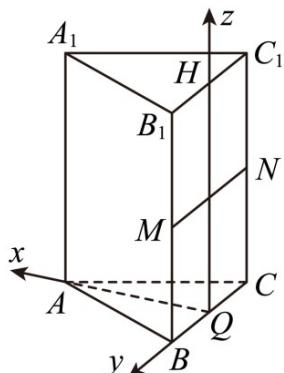

> [!faq]- 《专题11 立体几何的基本概念、点线面位置关系及表面积、体积的计算小题综合》真题解析
>
> > [!success]- **【答案】** BD
>
> > [!note]- **【分析】**
> > 对于 $^{A}$ ，由于等价向量关系，联系到一个三角形内，进而确定点的坐标；
> >
> > 对于 B，将 P 点的运动轨迹考虑到一个三角形内，确定路线，进而考虑体积是否为定值；
> >
> > 对于 $C$ ，考虑借助向量的平移将 $P$ 点轨迹确定，进而考虑建立合适的直角坐标系来求解 $P$ 点的个数；
> >
> > 对于 $D$ ，考虑借助向量的平移将 $P$ 点轨迹确定，进而考虑建立合适的直角坐标系来求解 $P$ 点的个数.
>
> > [!note]- **【解析】**
> > 
> > 易知，点 $P$ 在矩形 $BCC_{1}B_{1}$ 内部（含边界）.
> > 对于 A，当 $\lambda=1$ 时， $\overline{BP}=\overline{BC}+\mu\overline{BB}_{1}=\overline{BC}+\mu\overline{CC}_{1}$ ，即此时 $P\in$ 线段 $CC_{1}$ ， $^{\triangle}AB_{1}P$ 周长不是定值，故 A 错误；对于 B，当 $\mu=1$ 时， $\overline{BP}=\lambda\overline{BC}+\overline{BB}_{1}=\overline{BB}_{1}+\lambda\overline{B}_{1}C_{1}$ ，故此时 P 点轨迹为线段 $B_{1}C_{1}$ ，而 $B_{1}C_{1}//BC$ ， $B_{1}C_{1}//$ 平面 $A_{1}BC$ ，则有 P 到平面 $A_{1}BC$ 的距离为定值，所以其体积为定值，故 B 正确。
> > 对于 C，当 $\lambda=\frac{1}{2}$ 时， $\overrightarrow{BP}=\frac{1}{2}\overrightarrow{BC}+\mu\overrightarrow{BB}_{1}$ ，取 BC， $B_{1}C_{1}$ 中点分别为 Q，H，则 $\overrightarrow{BP}=\overrightarrow{BQ}+\mu\overrightarrow{QH}$ ，所以 P 点轨迹为线段 QH，不妨建系解决，建立空间直角坐标系如图， $A_{1}\left(\frac{\sqrt{3}}{2},0,1\right)$ ， $P(0,0,\mu)$ ， $B\left(0,\frac{1}{2},0\right)$ ，则 $\overrightarrow{A_{1}P}=\left(-\frac{\sqrt{3}}{2},0,\mu-1\right)$ ， $\overrightarrow{BP}=\left(0,-\frac{1}{2},\mu\right)$ ， $A_{1}P\cdot\overrightarrow{BP}=\mu(\mu-1)=0$ ，所以 $\mu=0$ 或 $\mu=1$ 。故 H,Q 均满足，故 C 错误；
> > 对于 D，当 $\mu=\frac{1}{2}$ 时， $\overrightarrow{BP}=\lambda\overrightarrow{BC}+\frac{1}{2}\overrightarrow{BB}_{1}$ ，取 $BB_{1}$ ， $CC_{1}$ 中点为 M,N． $\overrightarrow{BP}=BM+\lambda MN$ ，所以 P 点轨迹为线段 MN．设 $P\left(0,y_{0},\frac{1}{2}\right)$ ，因为 $A\left(\frac{\sqrt{3}}{2},0,0\right)$ ，所以 $\overrightarrow{AP}=\left(-\frac{\sqrt{3}}{2},y_{0},\frac{1}{2}\right)$ ， $\overrightarrow{A_{1}B}=\left(-\frac{\sqrt{3}}{2},\frac{1}{2},-1\right)$ ，所以 $\frac{3}{4}+\frac{1}{2}y_{0}-\frac{1}{2}=0\Rightarrow y_{0}=-\frac{1}{2}$ ，此时 P 与 N 重合，故 D 正确．
> > 故选：BD.
> > 【点睛】本题主要考查向量的等价替换，关键之处在于所求点的坐标放在三角形内.
