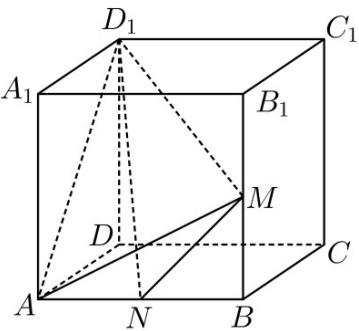

> [!faq]- 《专题11 立体几何的基本概念、点线面位置关系及表面积、体积的计算小题综合》真题解析
>
> > [!success]- **【答案】** 详见解析
>
> > [!note]- **【分析】**
> > 【分析】利用 $V_{A-NMD_{1}} = V_{D_{1}-AMN}$ 计算即可.
>
> > [!note]- **【解析】**
> > 【详解】
> > 
> > 因为正方体 $ABCD-A_{1}B_{1}C_{1}D_{1}$ 的棱长为 2，M、N 分别为 $BB_{1}$ 、AB 的中点
> > 所以 $V_{A-NMD_{1}} = V_{D_{1}-AMN} = \frac{1}{3} \times \frac{1}{2} \times 1 \times 1 \times 2 = \frac{1}{3}$
> > 故答案为： $\frac{1}{3}$
> > 【点睛】在求解三棱锥的体积时，要注意观察图形的特点，看把哪个当成顶点好计算一些
