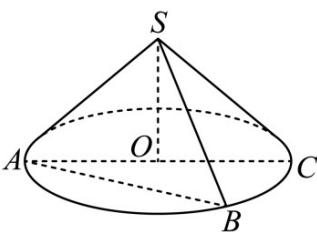

> [!faq]- 《专题11 立体几何的基本概念、点线面位置关系及表面积、体积的计算小题综合》真题解析
>
> > [!success]- **【答案】** 详见解析
>
> > [!note]- **【分析】**
> > 本题未单列分析。
>
> > [!note]- **【解析】**
> > 【答案】 $8\pi$
> > 【详解】分析：作出示意图，根据条件分别求出圆锥的母线 $SA$ ，高 $SO$ ，底面圆半径 $AO$ 的长，代入公式计算即可·
> > 详解：如下图所示， $\angle SAO = 30^{\circ}, \angle ASB = 90^{\circ}$
> > 又 $S_{\Delta SAB} = \frac{1}{2} SA\cdot SB = \frac{1}{2} SA^2 = 8$
> > 解得 SA = 4 ，所以 $SO = \frac{1}{2}SA = 2, AO = \sqrt{SA^{2} - SO^{2}} = 2\sqrt{3}$
> > 所以该圆锥的体积为 $V=\frac{1}{3}\cdot\pi\cdot OA^{2}\cdot SO=8\pi$ .
> > 
> > 点睛：此题为填空题的压轴题，实际上并不难，关键在于根据题意作出相应图形，利用平面几何知识求解相应线段长，代入圆锥体积公式即可·
