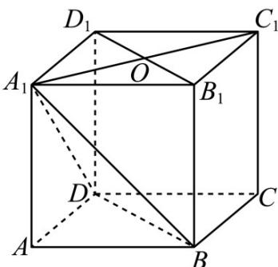
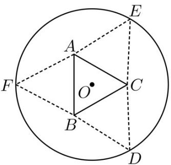
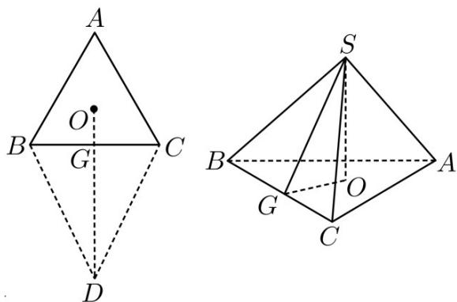

> [!faq]- 《专题11 立体几何的基本概念、点线面位置关系及表面积、体积的计算小题综合》真题解析
>
> > [!success]- **【答案】** $\frac{1}{3}$
>
> > [!note]- **【分析】**
> > 由题意分别求得底面积和高，然后求解其体积即可·
>
> > [!note]- **【解析】**
> > 
> > 如图所示，连结 $A_{1}C_{1}$ ，交 $B_{1}D_{1}$ 于点 $O$ ，很明显 $A_{1}C_{1} \perp$ 平面 $BDD_{1}B_{1}$
> > 则 $A_{1}O$ 是四棱锥的高，且 $A_{1}O = \frac{1}{2} A_{1}C_{1} = \frac{1}{2}\sqrt{1^{2} + 1^{2}} = \frac{\sqrt{2}}{2}$
> > $$
> > S _ {\text {四边形} B D D _ {1} B _ {1}} = B D \times D D _ {1} = \sqrt {2} \times 1 = \sqrt {2}
> > $$
> > 结合四棱锥体积公式可得其体积为
> > $$
> > V = \frac {1}{3} S h = \frac {1}{3} \times \sqrt {2} \times \frac {\sqrt {2}}{2} = \frac {1}{3}
> > $$
> > 故答案为 $\frac{1}{3}$
> > 点睛：本题主要考查棱锥体积的计算，空间想象能力等知识，意在考查学生的转化能力和计算求解能力·27．（2017·全国·高考真题）如图，圆形纸片的圆心为 O，半径为 5 cm，该纸片上的等边三角形 ABC 的中心为 O.D，E，F 为圆 O 上的点，△DBC，△ECA，△FAB 分别是以 BC，CA，AB 为底边的等腰三角形．沿虚线剪开后，分别以 BC，CA，AB 为折痕折起 △DBC，△ECA，△FAB，使得 D，E，F 重合，得到三棱锥．当 △ABC 的边长变化时，所得三棱锥体积 (单位：cm³) 的最大值为 \_\_\_\_．
> > 
> > 【答案】 $4 \sqrt{15}$
> > 【详解】如下图，连接 $DO$ 交 $BC$ 于点 $G$ ，设 $D, E, F$ 重合于 $S$ 点，正三角形的边长为 $x(5\sqrt{3} > x > 0)$ ，则 $OG = \frac{1}{3} \times \frac{\sqrt{3}}{2} x = \frac{\sqrt{3}}{6} x$ 。
> > $$
> > \therefore D G = S G = 5 - \frac {\sqrt {3}}{6} x
> > $$
> > $$
> > S O = h = \sqrt {S G ^ {2} - G O ^ {2}} = \sqrt {\left(5 - \frac {\sqrt {3}}{6} x\right) ^ {2} - \left(\frac {\sqrt {3}}{6} x\right) ^ {2}} = \sqrt {5 \left(5 - \frac {\sqrt {3}}{3} x\right)}
> > $$
> > 三棱锥的体积 $V=\frac{1}{3}S_{\triangle ABC}\cdot h=\frac{1}{3}\times\frac{\sqrt{3}}{4}x^{2}\times\sqrt{5\left(5-\frac{\sqrt{3}}{3}x\right)}=\frac{\sqrt{15}}{12}\sqrt{5x^{4}-\frac{\sqrt{3}}{3}x^{5}}$
> > 设 $n(x) = 5x^4 -\frac{\sqrt{3}}{3} x^5,x > 0$ ，则 $n^\prime (x) = 20x^{3} - \frac{5\sqrt{3}}{3} x^{4}$
> > 令 $n^{\prime}(x) = 0$ ，即 $4x^{3} - \frac{x^{4}}{\sqrt{3}} = 0$ ，得 $x = 4\sqrt{3}$ ，易知 $n(x)$ 在 $x = 4\sqrt{3}$ 处取得最大值·
> > $$
> > \therefore V _ {\max} = \frac {\sqrt {1 5}}{1 2} \times 4 8 \times \sqrt {5 - 4} = 4 \sqrt {1 5}
> > $$
> > 
> > 点睛:对于三棱锥最值问题，需要用到函数思想进行解决，本题解决的关键是设好未知量，利用图形特征表示出三棱锥体积·当体积中的变量最高次是 $^{2}$ 次时可以利用二次函数的性质进行解决，当变量是高次时需要用到求导的方式进行解决·
