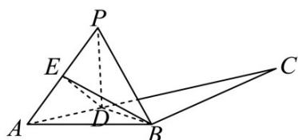

> [!faq]- 《专题11 立体几何的基本概念、点线面位置关系及表面积、体积的计算小题综合》真题解析
>
> > [!success]- **【答案】** $\frac{1}{2}$
>
> > [!note]- **【分析】**
> > 本题未单列分析。
>
> > [!note]- **【解析】**
> > $\Delta ABC$ 中，因为 $AB = BC = 2, \angle ABC = 120^{\circ}$
> > 所以 $\angle BAD = BCA = 30^{\circ}$
> > 由余弦定理可得 $AC^2 = AB^2 + BC^2 - 2AB \cdot BC \cos B$
> > $$
> > = 2 ^ {2} + 2 ^ {2} - 2 \times 2 \times 2 \cos 1 2 0 ^ {\circ} = 1 2
> > $$
> > 所以 $AC = 2\sqrt{3}$ .
> > 设 AD = x ，则 $0 < t < 2\sqrt{3}$ ， $DC = 2\sqrt{3} - x$ 。
> > 在 $\Delta ABD$ 中，由余弦定理可得 $BD^{2} = AD^{2} + AB^{2} - 2AD\cdot AB\cos A$
> > $$
> > = x ^ {2} + 2 ^ {2} - 2 x \cdot 2 \cos 3 0 ^ {\circ} = x ^ {2} - 2 \sqrt {3} x + 4.
> > $$
> > 故 $BD = \sqrt{x^2 - 2\sqrt{3}x + 4}$
> > 在 $\Delta PBD$ 中， $PD = AD = x$ ， $PB = BA = 2$
> > 由余弦定理可得 $\cos \angle BPD = \frac{PD^2 + PB^2 - BD^2}{2PD\cdot PB} = \frac{x^2 + 2^2 - (x^2 - 2\sqrt{3}x + 4)}{2\cdot x\cdot 2} = \frac{\sqrt{3}}{2}$
> > 所以 $\angle BPD = 30^{\circ}$ .
> > 
> > 过 P 作直线 BD 的垂线，垂足为 O·设 PO = d
> > 则 $S_{\Delta PBD} = \frac{1}{2} BD \times d = \frac{1}{2} PD \cdot PB \sin \angle BPD$
> > 即 $\frac{1}{2}\sqrt{x^2 - 2\sqrt{3}x + 4}\times d = \frac{1}{2} x\cdot 2\sin 30^\circ$
> > 解得 $d=\frac{x}{\sqrt{x^{2}-2\sqrt{3}x+4}}$ .
> > 而 $\Delta BCD$ 的面积 $S = \frac{1}{2} CD \cdot BC \sin \angle BCD = \frac{1}{2}(2\sqrt{3} - x) \cdot 2 \sin 30^{\circ} = \frac{1}{2}(2\sqrt{3} - x)$ .
> > 设 $PO$ 与平面 $ABC$ 所成角为 $\theta$ ，则点 $P$ 到平面 $ABC$ 的距离 $h = d\sin \theta$ .
> > 故四面体 $PBCD$ 的体积 $V = \frac{1}{3} S_{\Delta BcD} \times h = \frac{1}{3} S_{\Delta BcD} d \sin \theta \leq \frac{1}{3} S_{\Delta BcD} \cdot d = \frac{1}{3} \times \frac{1}{2} (2\sqrt{3} - x) \cdot \frac{x}{\sqrt{x^2 - 2\sqrt{3}x + 4}}$
> > $$
> > = \frac {1}{6} \frac {x (2 \sqrt {3} - x)}{\sqrt {x ^ {2} - 2 \sqrt {3} x + 4}}
> > $$
> > 设 $t = \sqrt{x^2 - 2\sqrt{3}x + 4} = \sqrt{(x - \sqrt{3})^2 + 1}$ ，因为 $0 \leq x \leq 2\sqrt{3}$ ，所以 $1 \leq t \leq 2\cdot$
> > 则 $\left|x-\sqrt{3}\right|=\sqrt{t^{2}-1}$ .
> > (1) 当 $0 \leq x \leq \sqrt{3}$ 时，有 $\left|x - \sqrt{3}\right| = \sqrt{3} - x = \sqrt{t^2 - 1}$
> > 故 $x = \sqrt{3} -\sqrt{t^2 - 1}$
> > 此时， $V = \frac{1}{6}\frac{(\sqrt{3} - \sqrt{t^2 - 1})[2\sqrt{3} - (\sqrt{3} - \sqrt{t^2 - 1})]}{t}$
> > $$
> > = \frac {1}{6} \cdot \frac {4 - t ^ {2}}{t} = \frac {1}{6} \left(\frac {4}{t} - t\right).
> > $$
> > $V'(t)=\frac{1}{6}(-\frac{4}{t^{2}}-1)$ ，因为 $1\leq t\leq2$ ，
> > 所以 $V'(t) < 0$ ，函数 $V(t)$ 在 $[1,2]$ 上单调递减，故 $V(t) \leq V(1) = \frac{1}{6} \left( \frac{4}{1} - 1 \right) = \frac{1}{2}$ .
> > (2) 当 $\sqrt{3} < x \leq 2\sqrt{3}$ 时，有 $\left|x - \sqrt{3}\right| = x - \sqrt{3} = \sqrt{t^{2} - 1}$
> > 故 $x = \sqrt{3} +\sqrt{t^2 - 1}$
> > 此时， $V = \frac{1}{6}\frac{(\sqrt{3} + \sqrt{t^2 - 1})[2\sqrt{3} - (\sqrt{3} + \sqrt{t^2 - 1})]}{t}$
> > $$
> > = \frac {1}{6} \cdot \frac {4 - t ^ {2}}{t} = \frac {1}{6} (\frac {4}{t} - t).
> > $$
> > 由（1）可知，函数 $V(t)$ 在(1,2]单调递减，故 $V(t) < V(1) = \frac{1}{6} (\frac{4}{1} - 1) = \frac{1}{2}$ .
> > 综上，四面体PBCD的体积的最大值为 $\frac{1}{2}$
