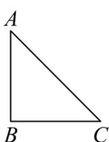
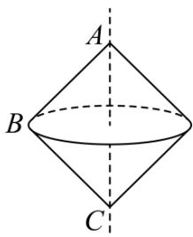

> [!faq]- 《专题11 立体几何的基本概念、点线面位置关系及表面积、体积的计算小题综合》真题解析
>
> > [!success]- **【答案】** B
>
> > [!note]- **【分析】**
> > 本题未单列分析。
>
> > [!note]- **【解析】**
> > 【答案】B
> > 【详解】试题分析：如图为等腰直角三角形旋转而成的旋转体，
> > $V = 2 \times \frac{1}{3} \pi R^{2} \cdot h = 2 \times \frac{1}{3} \pi (\sqrt{2})^{2} \cdot \sqrt{2} = \frac{4\sqrt{2}\pi}{3}$ ，故选 B
> > 
> > (1)
> > 
> > (2)
> > 考点：圆锥的体积公式.
