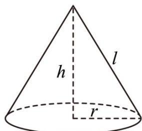

> [!faq]- 《专题11 立体几何的基本概念、点线面位置关系及表面积、体积的计算小题综合》真题解析
>
> > [!success]- **【答案】** $39\pi$
>
> > [!note]- **【分析】**
> > 利用体积公式求出圆锥的高，进一步求出母线长，最终利用侧面积公式求出答案·
>
> > [!note]- **【解析】**
> > $\because V=\frac{1}{3}\pi6^{2}\cdot h=30\pi$ ∴ $h = \frac{5}{2}$ ∴ $l = \sqrt{h^{2} + r^{2}} = \sqrt{\left(\frac{5}{2}\right)^{2} + 6^{2}} = \frac{13}{2}$ ∴ $S_{侧} = \pi rl = \pi \times 6 \times \frac{13}{2} = 39\pi$ .
> > 故答案为： $39\pi$
> > 
