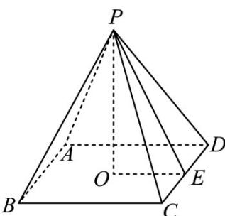

> [!faq]- 《专题11 立体几何的基本概念、点线面位置关系及表面积、体积的计算小题综合》真题解析
>
> > [!success]- **【答案】** C
>
> > [!note]- **【分析】**
> > 设 $CD = a, PE = b$ ，利用 $PO^2 = \frac{1}{2} CD \cdot PE$ 得到关于 $a, b$ 的方程，解方程即可得到答案。
>
> > [!note]- **【解析】**
> > 如图，设 $CD = a, PE = b$ ，则 $PO = \sqrt{PE^2 - OE^2} = \sqrt{b^2 - \frac{a^2}{4}}$ ，
> > 由题意 $PO^2 = \frac{1}{2} ab$ ，即 $b^2 - \frac{a^2}{4} = \frac{1}{2} ab$ ，化简得 $4\left(\frac{b}{a}\right)^2 - 2 \cdot \frac{b}{a} - 1 = 0$ ，
> > 解得 $\frac{b}{a} = \frac{1 + \sqrt{5}}{4}$ （负值舍去）·
> > 故选：C.
> > 
> > 【点睛】本题主要考查正四棱锥的概念及其有关计算，考查学生的数学计算能力，是一道容易题·
