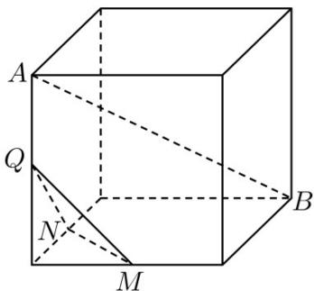
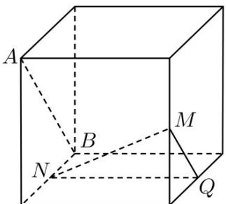
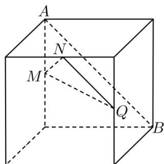

<!-- question-source:start -->
9. （2017·全国高考真题）（多选）如图，在下列四个正方体中，A, B 为正方体的两个顶点，M, N, Q 为所在棱的中点，则在这四个正方体中，直线 AB 与平面 MNQ 平行的是（）

A

B

C.

D

<!-- question-source:end -->

![[高中/真题/按题型分类/专题11 立体几何的基本概念、点线面位置关系及表面积、体积的计算小题综合/考点_01_点线面的位置关系及其判断/真题/answers/Q00034172A1.md]]
