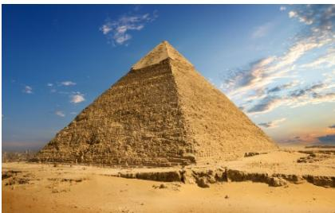

<!-- question-source:start -->
4.（2020·全国·高考真题）埃及胡夫金字塔是古代世界建筑奇迹之一，它的形状可视为一个正四棱锥，以该四棱锥的高为边长的正方形面积等于该四棱锥一个侧面三角形的面积，则其侧面三角形底边上的高与底面正方形的边长的比值为（）

A. $\frac{\sqrt{5} - 1}{4}$ B. $\frac{\sqrt{5} - 1}{2}$ C. $\frac{\sqrt{5} + 1}{4}$ D. $\frac{\sqrt{5} + 1}{2}$
<!-- question-source:end -->

![[高中/真题/按题型分类/专题11 立体几何的基本概念、点线面位置关系及表面积、体积的计算小题综合/考点_03_求几何体的侧面积_表面积/真题/answers/Q00034216A1.md]]
