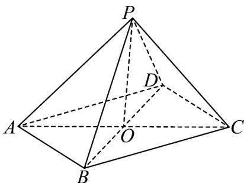
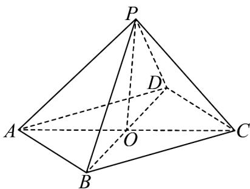

> [!faq]- 《专题11 立体几何的基本概念、点线面位置关系及表面积、体积的计算小题综合》真题解析
>
> > [!success]- **【答案】** C
>
> > [!note]- **【分析】**
> > 【分析】法一：利用全等三角形的证明方法依次证得 $\triangle PDO \cong \triangle PCO$ ， $\triangle PDB \cong \triangle PCA$ ，从而得到 $PA = PB$ ，再在 $\triangle PAC$ 中利用余弦定理求得 $PA = \sqrt{17}$ ，从而求得 $PB = \sqrt{17}$ ，由此在 $\triangle PBC$ 中利用余弦定理与三角形面积公式即可得解；
> > 法二：先在 $\triangle PAC$ 中利用余弦定理求得 $PA = \sqrt{17}$ ， $\cos \angle PCB = \frac{1}{3}$ ，从而求得 $PA \cdot PC = -3$ ，再利用空间向量的数量积运算与余弦定理得到关于 $PB, \angle BPD$ 的方程组，从而求得 $PB = \sqrt{17}$ ，由此在 $\triangle PBC$ 中利用余弦定理与三角形面积公式即可得解：
>
> > [!note]- **【解析】**
> > 【详解】法一：
> > 连结 AC, BD 交于 O，连结 PO，则 O 为 AC, BD 的中点，如图，
> > 
> > 因为底面 ABCD 为正方形，AB = 4，所以 $AC = BD = 4\sqrt{2}$ ，则 $DO = CO = 2\sqrt{2}$ ，
> > 又 $PC = PD = 3$ ， $PO = OP$ ，所以 $\triangle PDO\cong \triangle PCO$ ，则 $\angle PDO = \angle PCO$
> > 又 $PC = PD = 3$ ， $AC = BD = 4\sqrt{2}$ ，所以 $\triangle PDB\cong \triangle PCA$ ，则 $PA = PB$
> > 在 $\triangle PAC$ 中， $PC = 3, AC = 4\sqrt{2}, \angle PCA = 45^{\circ}$
> > 则由余弦定理可得 $PA^{2} = AC^{2} + PC^{2} - 2AC \cdot PC \cos \angle PCA = 32 + 9 - 2 \times 4\sqrt{2} \times 3 \times \frac{\sqrt{2}}{2} = 17$
> > 故 $PA = \sqrt{17}$ ，则 $PB = \sqrt{17}$
> > 故在 $\triangle \mathrm{PBC}$ 中， $PC = 3, PB = \sqrt{17}, BC = 4$
> > 所以 $\cos\angle PCB=\frac{PC^{2}+BC^{2}-PB^{2}}{2PC\cdot BC}=\frac{9+16-17}{2\times3\times4}=\frac{1}{3}$
> > 又 $0 < \angle PCB < \pi$ ，所以 $\sin \angle PCB = \sqrt{1 - \cos^2\angle PCB} = \frac{2\sqrt{2}}{3}$
> > 所以 $\triangle PBC$ 的面积为 $S = \frac{1}{2}PC \cdot BC \sin \angle PCB = \frac{1}{2} \times 3 \times 4 \times \frac{2\sqrt{2}}{3} = 4\sqrt{2}$ .
> > 法二：
> > 连结 AC, BD 交于 O，连结 PO，则 O 为 AC, BD 的中点，如图，因为底面 ABCD 为正方形，AB = 4，所以 $AC = BD = 4\sqrt{2}$ ，
> > 在 $\triangle PAC$ 中， $PC=3,\angle PCA=45^{\circ}$
> > 
> > 则由余弦定理可得 $PA^{2}=AC^{2}+PC^{2}-2AC\cdot PC\cos\angle PCA=32+9-2\times4\sqrt{2}\times3\times\frac{\sqrt{2}}{2}=17$ ，故 $PA=\sqrt{17}$
> > 所以 $\cos\angle APC=\frac{PA^{2}+PC^{2}-AC^{2}}{2PA\cdot PC}=\frac{17+9-32}{2\times\sqrt{17}\times3}=-\frac{\sqrt{17}}{17}$ ，则
> > $\overrightarrow{PA} \cdot \overrightarrow{PC} = \left| \overrightarrow{PA} \right| \left| \overrightarrow{PC} \right| \cos \angle APC = \sqrt{17} \times 3 \times \left( -\frac{\sqrt{17}}{17} \right) = -3$
> > 不妨记 $PB = m, \angle BPD = \theta$
> > 因为 $\overline{PO}=\frac{1}{2}\left(\overline{PA}+\overline{PC}\right)=\frac{1}{2}\left(\overline{PB}+\overline{PD}\right)$ ，所以 $\left(\overline{PA}+\overline{PC}\right)^{2}=\left(\overline{PB}+\overline{PD}\right)^{2}$
> > 即 $PA^{2} + PC^{2} + 2PA \cdot PC = PB^{2} + PD^{2} + 2PB \cdot PD$
> > 则 $17 + 9 + 2 \times (-3) = m^2 + 9 + 2 \times 3 \times m \cos \theta$ ，整理得 $m^2 + 6m \cos \theta - 11 = 0$ ①
> > 又在 $\triangle PBD$ 中， $BD^{2} = PB^{2} + PD^{2} - 2PB \cdot PD \cos \angle BPD$ ，即 $32 = m^{2} + 9 - 6m \cos \theta$ ，则 $m^{2} - 6m \cos \theta - 23 = 0$ ②，
> > 两式相加得 $2m^{2}-34=0$ ，故 $PB=m=\sqrt{17}$ ，
> > 故在 $\triangle PBC$ 中， $PC = 3, PB = \sqrt{17}, BC = 4$
> > 所以 $\cos\angle PCB=\frac{PC^{2}+BC^{2}-PB^{2}}{2PC\cdot BC}=\frac{9+16-17}{2\times3\times4}=\frac{1}{3}$
> > 又 $0 < \angle PCB < \pi$ ，所以 $\sin \angle PCB = \sqrt{1 - \cos^2 \angle PCB} = \frac{2\sqrt{2}}{3}$ ，
> > 所以 $\triangle PBC$ 的面积为 $S=\frac{1}{2}PC\cdot BC\sin\angle PCB=\frac{1}{2}\times3\times4\times\frac{2\sqrt{2}}{3}=4\sqrt{2}$
> >
> > 故选 **C**.
