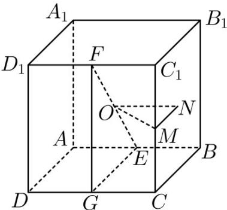

> [!faq]- 《专题12 球体的外接与内切小题综合》真题解析
>
> > [!success]- **【答案】** 详见解析
>
> > [!note]- **【分析】**
> > 【分析】根据正方体的对称性，可知球心到各棱距离相等，故可得解·
>
> > [!note]- **【解析】**
> > 【详解】不妨设正方体棱长为 $^{2}$ ，EF中点为O，取CD， $CC_{1}$ 中点G,M，侧面 $BB_{1}C_{1}C$ 的中心为N，连接FG,EG,OM,ON,MN，如图，
> > 
> > 由题意可知， $O$ 为球心，在正方体中， $EF = \sqrt{FG^2 + EG^2} = \sqrt{2^2 + 2^2} = 2\sqrt{2}$
> > 即 $R = \sqrt{2}$
> > 则球心 O 到 $CC_{1}$ 的距离为 $OM = \sqrt{ON^{2} + MN^{2}} = \sqrt{1^{2} + 1^{2}} = \sqrt{2}$
> > 所以球 O 与棱 $CC_{1}$ 相切，球面与棱 $CC_{1}$ 只有 1 个交点，
> > 同理，根据正方体的对称性知，其余各棱和球面也只有 $^{1}$ 个交点，
> > 所以以 EF 为直径的球面与正方体棱的交点总数为 12.
> > 故答案为：12
