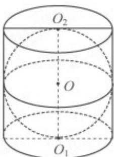

<!-- question-source:start -->
3. (2017·江苏·高考真题) 如图, 在圆柱 $O1O2$ 内有一个球 $O$ , 该球与圆柱的上、下底面及母线均相切. 记圆柱 $O1O2$ 的体积为 $V1$ , 球 $O$ 的体积为 $V2$ , 则 $\frac{V_1}{V_2}$ 的值是

<!-- question-source:end -->

![[高中/真题/按题型分类/专题12 球体的外接与内切小题综合/考点03_圆锥与圆柱中的球体切接问题/真题/answers/Q00034229A1.md]]
