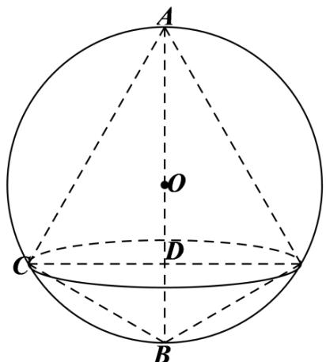

> [!faq]- 《专题12 球体的外接与内切小题综合》真题解析
>
> > [!success]- **【答案】** B
>
> > [!note]- **【分析】**
> > 作出图形，计算球体的半径，可计算得出两圆锥的高，利用三角形相似计算出圆锥的底面圆半径，再利用锥体体积公式可求得结果·
>
> > [!note]- **【解析】**
> > 如下图所示，设两个圆锥的底面圆圆心为点D，
> > 设圆锥 AD 和圆锥 BD 的高之比为 3:1，即 AD = 3BD，
> > 
> > 设球的半径为 $R$ ，则 $\frac{4\pi R^3}{3} = \frac{32\pi}{3}$ ，可得 $R = 2$ ，所以， $AB = AD + BD = 4BD = 4$ ，
> > 所以， $BD = 1$ ， $AD = 3$
> > ∵ $CD \perp AB$ ，则 $\angle CAD + \angle ACD = \angle BCD + \angle ACD = 90^{\circ}$ ，所以， $\angle CAD = \angle BCD$
> > 又因为 $\angle ADC = \angle BDC$ ，所以， $\triangle ACD \sim \triangle CBD$
> > 所以， $\frac{AD}{CD}=\frac{CD}{BD}$ ，∴ $CD=\sqrt{AD\cdot BD}=\sqrt{3}$ ，
> > 因此，这两个圆锥的体积之和为 $\frac{1}{3}\pi \times CD^2\cdot (AD + BD) = \frac{1}{3}\pi \times 3\times 4 = 4\pi$
> >
> > 故选 **B**.
