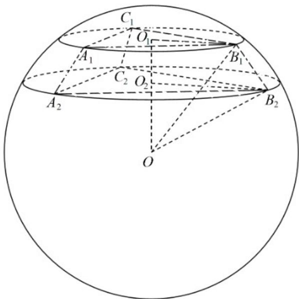

> [!faq]- 《专题12 球体的外接与内切小题综合》真题解析
>
> > [!success]- **【答案】** A
>
> > [!note]- **【分析】**
> > 根据题意可求出正三棱台上下底面所在圆面的半径 $r_{1}, r_{2}$ ，再根据球心距，圆面半径，以及球的半径之间的关系，即可解出球的半径，从而得出球的表面积。
>
> > [!note]- **【解析】**
> > 设正三棱台上下底面所在圆面的半径 $r_{1}, r_{2}$ ，所以 $2r_{1} = \frac{3\sqrt{3}}{\sin 60^{\circ}}, 2r_{2} = \frac{4\sqrt{3}}{\sin 60^{\circ}}$ ，即 $r_{1} = 3, r_{2} = 4$ ，设球心到上下底面的距离分别为 $d_{1}, d_{2}$ ，球的半径为 $R$ ，所以 $d_{1} = \sqrt{R^{2} - 9}$ ， $d_{2} = \sqrt{R^{2} - 16}$ ，故 $|d_{1} - d_{2}| = 1$ 或 $d_{1} + d_{2} = 1$ ，即 $\left|\sqrt{R^{2} - 9} - \sqrt{R^{2} - 16}\right| = 1$ 或 $\sqrt{R^{2} - 9} + \sqrt{R^{2} - 16} = 1$ ，解得 $R^{2} = 25$ 符合题意，所以球的表面积为
> > $$
> > S = 4 \pi R ^ {2} = 1 0 0 \pi
> > $$
> > 故选：A.
> > 
