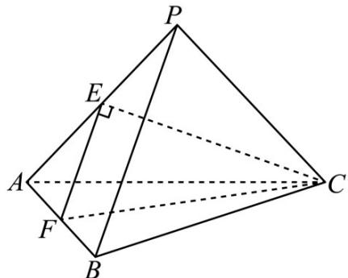
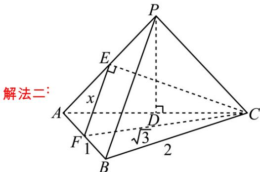

> [!faq]- 《专题12 球体的外接与内切小题综合》真题解析
>
> > [!success]- **【答案】** D
>
> > [!note]- **【分析】**
> > 先证得 $PB \perp$ 平面 $PAC$ ，再求得 $PA = PB = PC = \sqrt{2}$ ，从而得 $P - ABC$ 为正方体一部分，进而知正方体的体对角线即为球直径，从而得解·
>
> > [!note]- **【解析】**
> > 解法一∵ PA = PB = PC, $\Delta ABC$ 为边长为 2 的等边三角形，∴ P - ABC 为正三棱锥，
> > ∴ $PB \perp AC$ ，又 E，F 分别为 PA、AB 中点，
> > $\therefore EF // PB, \therefore EF \perp AC$ ，又 $EF \perp CE, CE \cap AC = C, \therefore EF \perp$ 平面 $PAC, PB \perp$ 平面 $PAC$ $\therefore \angle APB = 90^{\circ}, \therefore PA = PB = PC = \sqrt{2}, \therefore P - ABC$ 为正方体一部分， $2R = \sqrt{2 + 2 + 2} = \sqrt{6}$ ，即 $R = \frac{\sqrt{6}}{2}, \therefore V = \frac{4}{3}\pi R^{3} = \frac{4}{3}\pi \times \frac{6\sqrt{6}}{8} = \sqrt{6}\pi$ ，故选 D.
> > 
> > 
> > 设 PA = PB = PC = 2x ， E, F 分别为 PA, AB 中点，
> > $\therefore EF // PB$ ，且 $EF = \frac{1}{2} PB = x$ ， $\because \Delta ABC$ 为边长为 $^2$ 的等边三角形，
> > $\therefore CF = \sqrt{3}$ 又 $\angle CEF = 90^{\circ}$ $\therefore CE = \sqrt{3 - x^{2}}$ ， $AE = \frac{1}{2} PA = x$
> > $\Delta AEC$ 中余弦定理 $\cos\angle EAC=\frac{x^{2}+4-\left(3-x^{2}\right)}{2\times2\times x}$ ，作 $PD\perp AC$ 于D，∵PA=PC，
> > ∵ D 为 AC 中点， $\cos\angle EAC=\frac{AD}{PA}=\frac{1}{2x}$ ，∴ $\frac{x^{2}+4-3+x^{2}}{4x}=\frac{1}{2x}$
> > $\therefore 2x^{2} + 1 = 2 \quad \therefore x^{2} = \frac{1}{2} \quad x = \frac{\sqrt{2}}{2}$ ， $\therefore PA = PB = PC = \sqrt{2}$ ，又 $AB = BC = AC = 2$ ， $\therefore PA, PB, PC$ 两两垂直，
> > $\therefore 2R = \sqrt{2 + 2 + 2} = \sqrt{6}$ ， $\therefore R = \frac{\sqrt{6}}{2}$ ， $\therefore V = \frac{4}{3}\pi R^3 = \frac{4}{3}\pi \times \frac{6\sqrt{6}}{8} = \sqrt{6}\pi$ ，故选D.
> > 【点睛】本题考查学生空间想象能力，补体法解决外接球问题．可通过线面垂直定理，得到三棱两两互相垂直关系，快速得到侧棱长，进而补体成正方体解决．
