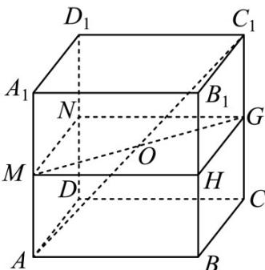

> [!faq]- 《专题12 球体的外接与内切小题综合》真题解析
>
> > [!success]- **【答案】** 详见解析
>
> > [!note]- **【分析】**
> > 【分析】当球是正方体的外接球时半径最大，当边长为4的正方形是球的大圆的内接正方形时半径达到最小·
>
> > [!note]- **【解析】**
> > 【详解】设球的半径为 $R$ ·
> > 当球是正方体的外接球时，恰好经过正方体的每个顶点，所求的球的半径最大，若半径变得更大，球会包含正方体，导致球面和棱没有交点，
> > 正方体的外接球直径 $2R'$ 为体对角线长 $AC_{1} = \sqrt{4^{2} + 4^{2} + 4^{2}} = 4\sqrt{3}$ ，即 $2R' = 4\sqrt{3}, R' = 2\sqrt{3}$ ，故 $R_{\max} = 2\sqrt{3}$ ；
> > 
> > 分别取侧棱 $AA_{1}, BB_{1}, CC_{1}, DD_{1}$ 的中点 $M, H, G, N$ ，显然四边形 $MNGH$ 是边长为 4 的正方形，且 $O$ 为正方形 $MNGH$ 的对角线交点，
> > 连接 $MG$ ，则 $MG = 4\sqrt{2}$ ，当球的一个大圆恰好是四边形MNGH的外接圆，球的半径达到最小，即 $R$ 的最小值为 $2\sqrt{2}$
> > 综上， $R \in [2\sqrt{2}, 2\sqrt{3}]$ .
> > 故答案为： $[2\sqrt{2}, 2\sqrt{3}]$
