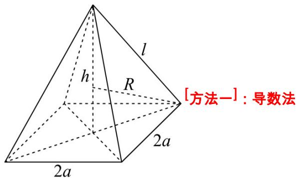

> [!faq]- 《专题12 球体的外接与内切小题综合》真题解析
>
> > [!success]- **【答案】** C
>
> > [!note]- **【分析】**
> > 设正四棱锥的高为 $h$ ，由球的截面性质列方程求出正四棱锥的底面边长与高的关系，由此确定正四棱锥体积的取值范围·
>
> > [!note]- **【解析】**
> > ∵球的体积为 $36\pi$ ，所以球的半径 R = 3，
> > 
> > [方法一]：导数法
> > 设正四棱锥的底面边长为 2a，高为 h，
> > 则 $l^{2}=2a^{2}+h^{2}$ ， $3^{2}=2a^{2}+(3-h)^{2}$
> > 所以 $6h = l^2$ ， $2a^{2} = l^{2} - h^{2}$
> > 所以正四棱锥的体积 $V = \frac{1}{3} Sh = \frac{1}{3}\times 4a^{2}\times h = \frac{2}{3}\times (l^{2} - \frac{l^{4}}{36})\times \frac{l^{2}}{6} = \frac{1}{9}\left(l^{4} - \frac{l^{6}}{36}\right)$
> > 所以 $V^{\prime} = \frac{1}{9}\left(4l^{3} - \frac{l^{5}}{6}\right) = \frac{1}{9} l^{3}\left(\frac{24 - l^{2}}{6}\right)$
> > 当 $3 \leq l \leq 2\sqrt{6}$ 时， $V' > 0$ ，当 $2\sqrt{6} < l \leq 3\sqrt{3}$ 时， $V' < 0$
> > 所以当 $l = 2\sqrt{6}$ 时，正四棱锥的体积 $V$ 取最大值，最大值为 $\frac{64}{3}$
> > 又 $l = 3$ 时， $V = \frac{27}{4}$ ， $l = 3\sqrt{3}$ 时， $V = \frac{81}{4}$ ，
> > 所以正四棱锥的体积 $V$ 的最小值为 $\frac{27}{4}$
> > 所以该正四棱锥体积的取值范围是 $\left[\frac{27}{4},\frac{64}{3}\right]$
> > 故选：C.
> > [方法二]：基本不等式法
> > 由方法一故所以 $V=\frac{4}{3}a^{2}h=\frac{2}{3}\left(6h-h^{2}\right)h=\frac{1}{3}(12-2h)h\times h,\quad\frac{1}{3}\times\left[\frac{(12-2h)+h+h}{3}\right]^{3}=\frac{64}{3}$ （当且仅当 h=4 取到），
> > 当 $h = \frac{3}{2}$ 时，得 $a = \frac{3\sqrt{3}}{\sqrt{2}}$ ，则 $V_{\mathrm{min}} = \frac{1}{3} a^2 h = \frac{1}{3} (\frac{3\sqrt{3}}{\sqrt{2}})^2\times \frac{3}{2} = \frac{27}{4};$
> > 当 $l = 3\sqrt{3}$ 时，球心在正四棱锥高线上，此时 $h = \frac{3}{2} + 3 = \frac{9}{2}$ ，$\frac{\sqrt{2}}{2} a = \frac{3\sqrt{3}}{2} \Rightarrow a = \frac{3\sqrt{3}}{\sqrt{2}}$ ，正四棱锥体积 $V_{1} = \frac{1}{3} a^{2}h = \frac{1}{3}\left(\frac{3\sqrt{3}}{\sqrt{2}}\right)^{2} \times \frac{9}{2} = \frac{81}{4} < \frac{64}{3}$ ，故该正四棱锥体积的取值范围是 $[\frac{27}{4}, \frac{64}{3}]$ .
