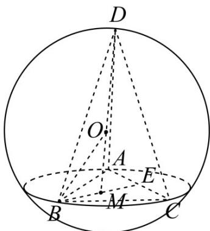

> [!faq]- 《专题12 球体的外接与内切小题综合》真题解析
>
> > [!success]- **【答案】** B
>
> > [!note]- **【分析】**
> > 本题未单列分析。
>
> > [!note]- **【解析】**
> > 【答案】B
> > 【详解】分析：作图， $D$ 为 $MO$ 与球的交点，点 $M$ 为三角形 $ABC$ 的中心，判断出当 $DM \perp$ 平面 $ABC$ 时，三棱锥D-ABC体积最大，然后进行计算可得.
> > 详解：如图所示，
> > 
> > 点 $^{M}$ 为三角形ABC的中心， $^{E}$ 为AC中点，
> > 当DM⊥平面ABC时，三棱锥D-ABC体积最大
> > 此时，OD=OB=R=4 $\because S_{\triangle ABC}=\frac{\sqrt{3}}{4}AB^{2}=9\sqrt{3}$ $\therefore AB=6,$ $\because$ 点 $^{M}$ 为三角形 $^{ABC}$ 的中心 $\therefore BM=\frac{2}{3}BE=2\sqrt{3}$ $\therefore Rt\triangle OMB$ 中，有OM= $\sqrt{OB^{2}-BM^{2}}=2$ $\therefore DM=OD+OM=4+2=6$ $\therefore\left(V_{D-ABC}\right)_{\max}=\frac{1}{3}\times9\sqrt{3}\times6=18\sqrt{3}$
> > 故选 B.
> > 点睛：本题主要考查三棱锥的外接球，考查了勾股定理，三角形的面积公式和三棱锥的体积公式，判断出当DM⊥平面ABC时，三棱锥D-ABC体积最大很关键，由 $^{M}$ 为三角形ABC的重心，计算得到BM= $\frac{2}{3}BE=2\sqrt{3}$ ，再由勾股定理得到OM，进而得到结果，属于较难题型。
